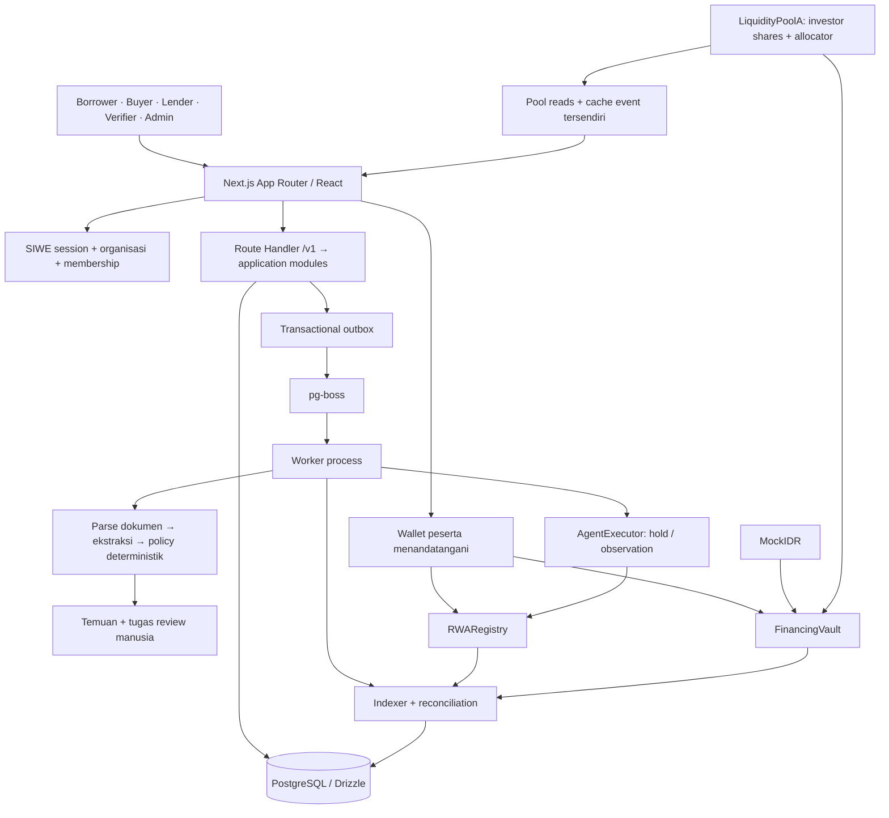
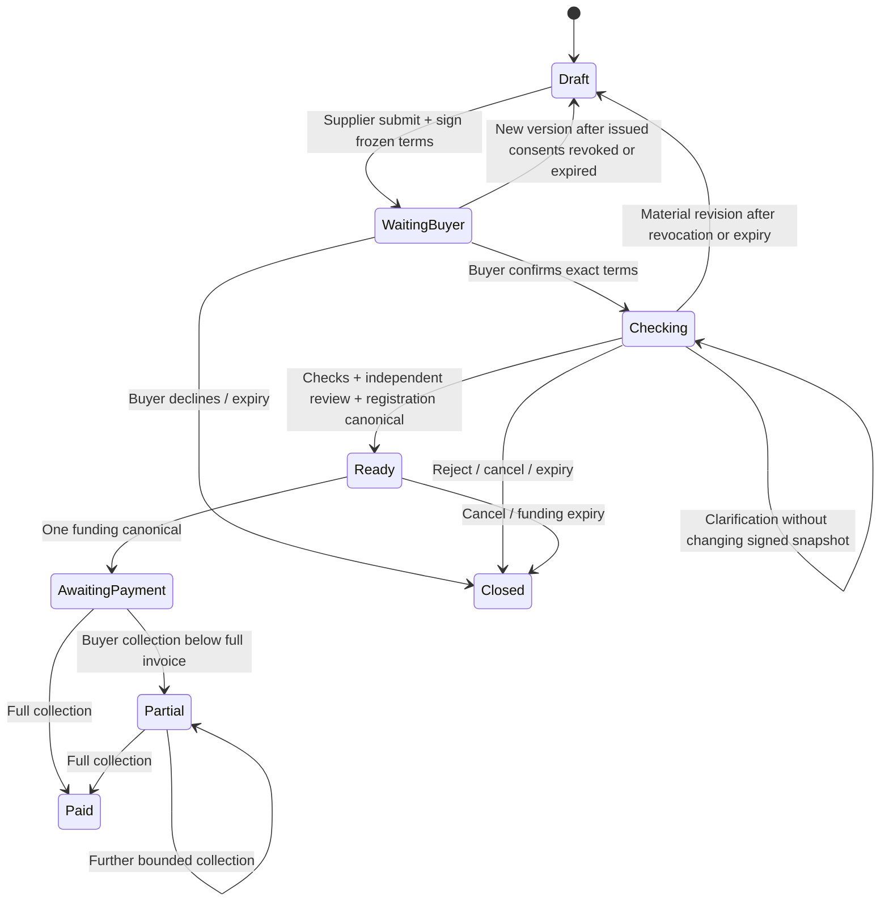

# TALUNAI — Full Product & System Simplification Audit

Tanggal audit: **29 September 2026**. Status: **analisis dan rencana; belum diimplementasikan**.

Dokumen ini adalah baseline audit pada saat pemeriksaan awal. Implementasi dan batas terbaru tercatat di [status perbaikan](TALUNAI_REMEDIATION_STATUS.md).

Urutan baca ringkas: [temuan](#b-problems-found) → [model produk](#d-final-simplified-product-model) → [journey](#e-final-user-journeys) → [rencana implementasi](#q-implementation-plan). Bagian lainnya merinci keputusan dan bukti teknis.

## Keputusan utama

Talunai sebaiknya menjadi aplikasi untuk **mendanai Deal invoice B2B yang sudah diserahkan dan diakui buyer**, dengan satu lender per Deal. Satu detail Deal menjawab nominal, jatuh tempo, pihak yang perlu bertindak, dan langkah berikutnya. Dashboard merupakan antrean tindakan, bukan halaman statistik tambahan.

**Rekomendasi scope MVP:** pendanaan langsung per Deal menjadi alur utama. Pool yang sudah terpasang tetap memiliki akses posisi, bukti transaksi, harvest, dan penarikan milik investor; ekspansi/deposit/alokasi baru direkomendasikan ditahan sampai risiko pool pada bagian B/L selesai. Ini usulan produk, **bukan perubahan yang sudah dijalankan**. Pool bukan prasyarat pembuktian hipotesis invoice financing, dan belum cukup matang untuk diposisikan seperti tabungan DeFi yang bisa ditarik sewaktu-waktu.

Pertahankan pemisahan kontrak kesepakatan, custody uang, dan kewenangan agent. Penyederhanaan terbesar berada pada UX, model status, urutan persetujuan, dan read model; mengganti nama semua tabel atau menyatukan kontrak tidak otomatis memperbaiki produk.

### Metode dan batas bukti

- Audit sumber terindeks: 188 file; frontend, API, skema/migrasi, worker, agent, chain, lima kontrak, dan pengujian terkait. Graph dipakai untuk lokasi/relasi; definisi relevan dibaca kembali untuk memeriksa detail.
- Skill yang digunakan: `critique`, `distill`, dan prinsip bersama `frontend-design`. Brief terbaru pengguna mengatur scope, prioritas, bahasa, serta Warm Precision; tidak diperlukan penggalian preferensi baru.
- Pemeriksaan database memakai transaksi **read only**. Pemeriksaan BSC memakai pembacaan kontrak, tanpa broadcast. Tidak ada perubahan kode aplikasi, database, role, atau kontrak pada tahap audit.
- **95 unit test / 7 file lulus**, serta **39 test Foundry lulus** saat audit. Ini baseline, bukan bukti bahwa semua alur atau semua kerentanan telah tercakup. Counterexample pool di bawah dianalisis dari rumus, belum dieksekusi sebagai exploit.
- Web port 3000 tidak berjalan saat pemeriksaan HTTP/HTTPS. Audit visual memakai screenshot tersimpan 29 September dan kode; tidak mengklaim pengujian browser baru. PostgreSQL dapat dibaca dan heartbeat worker/indexer masih baru (pemeriksaan 11:47:49 UTC: umur 31/11 detik).
- `.env.local` menunjukkan chain 97, `LLM_MODE=mock`, key OpenRouter belum terpasang. Ini bukan bukti inference AI live. Jangan menyalin credential ke laporan/pitch.
- Database aktif memiliki satu claim kanonis: `06721f35-2849-4b85-9f13-7687625a4d35`, invoice `KAKAO/2026/POOL-917EEA12-58F3DDCA`, Koperasi Kakao Sintetis → Pembeli Kakao Sintetis. Principal 70.000.000; invoice 100.000.000. `invoiceDueAt=1794558240` cocok antara DB dan registry pada blok 133856374: **13 November 2026, 15:24 WIB**. Tidak ditemukan bukti drift tanggal pada pembandingan ini.
- Receipt yang sudah ada membuktikan satu siklus testnet selesai, bukan Deal baru yang masih menunggu pendanaan. Lihat [receipt kanonis](TESTNET_FLOW_RECEIPTS.md). Status ready/pending dalam rencana demo baru adalah target rehearsal, bukan status record lama.

### Cara membaca temuan

**Terbukti** berarti perilaku langsung terlihat pada kode, query read only, atau tes. **Counterexample** berarti skenario logis dengan prasyarat yang disebutkan. **Rekomendasi** berarti desain tujuan, belum tersedia. Tidak ada klaim audit keamanan independen atau kepatuhan layanan finansial produksi.

## A. Current System Map

### Inventaris sistem saat ini

| Lapisan | Implementasi sekarang | Implikasi |
|---|---|---|
| Frontend | Next.js 16.3.6, React 19, TypeScript, TanStack Query/Form/Table, komponen Base UI, Manrope, Warm Precision | Fondasi visual dapat dipertahankan; masalah utama pemetaan tugas/state |
| Routes | `/app/*`, namespace borrower/buyer/lender/verifier/admin, namespace operator `/agent`, login, onboarding | Banyak URL mencerminkan role/internal object; komponen sebenarnya banyak dipakai bersama |
| API | Satu catch-all Next Route Handler `/v1/[...path]`, handler auth/claims/actions/onboarding/ops/read models | Tidak ada kebutuhan menambah Fastify atau microservice |
| Domain | Finance bigint, identity, goods, evidence, policy | Bagian penting untuk ketepatan dan shared assertions |
| Database | 33 tabel aplikasi + `schema_migrations`, di luar tabel milik pg-boss | Jumlahnya tidak seluruhnya kompleksitas palsu; history dan recovery memerlukan record terpisah |
| Worker | Process terpisah; outbox, dua jenis aksi utama agent, indexing, reconciliation, upload cleanup | Arsitektur satu repo/two processes sudah sesuai |
| Agent | Parser teks/PDF, adapter mock/OpenRouter, validasi sumber, pengecekan deterministik, review task | Agent bukan chatbot, bukan pemberi persetujuan kredit; mode aktif masih mock |
| Chain | Registry, Vault, AgentExecutor, MockIDR, **LiquidityPoolA** | Pool adalah kontrak kelima yang tidak tercantum dalam daftar awal brief |
| Sumber uang | User wallet → vault/borrower; buyer → vault → penerima tetap; pool dapat menjadi lender kontrak | Harus membedakan investor pool dengan lender yang tercatat pada Deal |
| Sumber kebenaran | DB untuk draft/dokumen/keputusan; signed snapshot untuk terms; event canonical + contract reads untuk uang | Tidak cukup memakai `claims.workflow` untuk status setelah funding |

### Audit tujuh pertanyaan, satu per satu

Kolom berikut menjawab fungsi, kebutuhan, kerumitan, penggabungan, keterlihatan pada user, risiko penyederhanaan, dan bentuk final.

| Bagian | Fungsi | Dibutuhkan? | Terlalu rumit? | Gabung dengan | User perlu melihat | Risiko jika dipangkas | Bentuk paling sederhana |
|---|---|---|---|---|---|---|---|
| Product model | Mempercepat penerimaan invoice | Ya | Dua cerita: Deal dan pool | Satu Deal sebagai pusat | Nominal, fee, due, pihak | Menjanjikan likuiditas/hasil yang tak tersedia | Fixed delivered B2B receivable |
| User journeys | Memindahkan pekerjaan antar pihak | Ya | Review lalu signature tidak cocok buyer-first | Antrean tindakan + detail | Langkah sendiri dan siapa menunggu | Salah urut consent/approval | Satu tindakan utama per state |
| Frontend routes | Lokasi pekerjaan | Ya | Namespace role duplikat | Adaptive `/app` | Dua menu utama | ACL dianggap cukup di route | Shared route + object authorization |
| Components | Menyajikan data/aksi | Ya | Page monolitik dan status duplikat | DealSummary, NextAction, MoneyBreakdown | Komponen bisnis yang konsisten | Abstraksi universal menambah cabang | Komponen sesuai tugas |
| Navigation | Menemukan tugas | Ya | Deals, tugas, pembayaran, aktivitas tersebar | Pembayaran/aktivitas ke Deal | Tindakan, Deals, akun | Fitur berhak jadi tak ditemukan | Dua nav utama + settings + internal |
| Copy | Menjelaskan keputusan | Ya | Campur claim, principal, nonce, policy | Kamus tunggal | Bahasa bisnis | Menyembunyikan konsekuensi finansial | Pendanaan, pembayaran, saldo |
| Authentication | Membuktikan penguasaan wallet | Ya | Prompt/chain/session membebani onboarding | Satu entry login reusable | Wallet aktif, organisasi, error recovery | Menganggap connect sebagai login | SIWE sekali per sesi, recheck saat transaksi |
| RBAC | Membatasi tindakan | Ya, wajib | Role saja tidak cukup | Satu policy action+relationship | Aksi yang relevan dan alasan terblokir | IDOR/self-approval | Capability berasal dari backend, dievaluasi ulang |
| Organization | Pihak bisnis dan authority | Ya | Self-service dibatasi satu membership/signer | Settings + akses admin | Organisasi aktif saat perlu | Peran dari satu org bocor ke org lain | Satu konteks org; signer tetap per Deal |
| Backend modules | Menjalankan use case | Ya | Bukan microservices; file besar menjadi hotspot | Financing/payments sebagai modul uang | Tidak | Pecah abstraksi tanpa manfaat | Modul kecil dalam monolith |
| Database | History dan transaksi atomik | Ya | Ada output agent/notifikasi berulang | Hasil checks dan keputusan bertipe | Tidak | Kehilangan signature/review/event lama | History immutable + projection rebuildable |
| API | Menyampaikan intent user | Ya | Granular transaksi bocor ke klien | Endpoint intent Deal | Respons aksi dan recovery | Endpoint bebas calldata | Endpoint eksplisit dengan template allowlist |
| Background worker | Pekerjaan mahal/asinkron | Ya | Tick berurutan dan lock panjang | Satu worker, tugas terpisah jelas | Status pemeriksaan/konfirmasi | Duplicate side effects | Outbox idempotent + retries terbatas |
| Agent workflow | Ekstraksi dan temuan bukti | Ya untuk hipotesis AI | Ada scaffolding tool tak dipakai | Checks dalam Deal | Temuan, sumber, langkah berikut | Menghapus provenance/human gate | Background checks, tanpa confidence palsu |
| Smart contracts | Persetujuan immutable dan aliran uang | Ya | Empat boundary inti wajar; pool opsional | Jangan gabung custody dengan AI | Bukti tx dan konsekuensi | Memperbesar kewenangan/menghilangkan invariant | Registry + Vault + executor sempit + satu token |
| Accounting | Quote, waterfall, saldo | Ya, wajib | Terpecah projection/pool/UI | Satu model uang publik | Lima angka utama, claimable jika relevan | Float, salah lunas, double credit | Integer exact; collection ≠ withdrawal |
| Transaction lifecycle | Menangani wallet sampai canonical | Ya, wajib | Tahap teknis tampil berlebihan | Satu TransactionProgress | Meminta wallet / konfirmasi / hasil | Optimistic financial success | Simpan intent, validasi receipt, tunggu projection |
| Indexer | Membentuk state canonical | Ya, wajib | Pool punya pipeline kedua | Satu indexer event untuk semua kontrak yang didukung | Kesegaran data, sync jika perlu | Orphan log tetap di UI | Rewind/replay + provenance block |
| Errors | Memandu pemulihan | Ya | Sebagian raw reason/template bercampur | ActionState + error dictionary | Penyebab konkret dan CTA | Error disembunyikan sebagai data kosong | Error terlokalisasi, input tetap tersimpan |
| Loading | Menjelaskan menunggu | Ya | Progress agent ditulis dalam satu transaksi | Pending states di tempat aksi | Satu indikator jujur | Progress palsu / UI terlihat hang | Skeleton awal; data lama bertanda stale |
| Empty states | Menjelaskan nol data | Ya | Bisa tampak analytics kosong | Inbox/list masing-masing | Alasan dan next action | Menampilkan fake metrics | Empty spesifik per role/keadaan |
| Audit logs | Menjelaskan siapa mengubah apa | Ya, wajib | Log internal bercampur aktivitas bisnis | Activity bisnis ringkas + internal audit | Riwayat keputusan terkait Deal | Kehilangan attribution | Append-only di app; akses investigasi terkontrol |
| Security boundaries | Memisahkan identity/approval/custody | Ya, wajib | UI role tidak mencerminkan semua power chain | Dokumentasi/matrix satu sumber | Kewenangan saat relevan | Mengklaim admin/agent tak punya power padahal ada | Matrix aplikasi dan chain terpisah |
| Demo flow | Membuktikan hipotesis | Ya | Banyak fitur bersaing dan dokumen lama bertentangan | Satu Deal, satu cerita | Sebab → aksi → uang | Memakai settled record seolah belum didanai | Rehearsal nyata dengan receipt |
| Landing | Memberi konteks awal | P5 | Belum perlu diprioritaskan | Preview Deal nyata | Apa produk dan CTA | Mengalihkan waktu dari core | Empat bagian singkat |
| Analytics/pool | Menjelaskan posisi/yield | Sekunder | Produk investasi tambahan | Ringkasan posisi yang benar-benar dimiliki | Exposure, claimable, risiko lock | Menyamakan NAV dengan cash | Bukan alur default; jangan sembunyikan posisi lama |

## B. Problems Found

Severity: **CRITICAL** = jalur kerugian/akses tanpa otorisasi yang terbukti dan mendesak; **HIGH** = salah status uang, kontrol keselamatan hilang, atau alur utama buntu; **MEDIUM** = keandalan/kebingungan material dengan batas; **LOW** = konsistensi/polish. Tidak ada temuan CRITICAL yang diklaim terbukti dalam audit terbatas ini. Itu tidak berarti tidak mungkin ada kerentanan kritis.

| ID | Kelompok / severity | Temuan dan bukti | Dampak / keputusan |
|---|---|---|---|
| F01 | State / **HIGH** | `PARTIALLY_RECOVERED` dikembalikan [pool read:378](../packages/pool/read.ts#L378), tetapi renderer [Explore:717](../src/app/app/explore/page.tsx#L717) memetakan fallback selain ACTIVE/OVERDUE ke “Lunas” | Pembayaran sebagian terlihat selesai. Exhaustive enum + satu status presenter wajib P0 |
| F02 | Security / **HIGH** | Revocation consent di DB setelah perubahan tidak membatalkan signature yang sudah dimiliki pihak lain; [limitations](LIMITATIONS.md) menyatakan batas ini; registry memakai nonce/hash onchain | Freeze signed terms; perubahan harus menunggu nonce invalidation/expiry yang terbukti. Jangan menyebut DB revoke sebagai pencabutan chain |
| F03 | Backend/state / **HIGH** | [claims dispute:643–682](../packages/api/claims.ts#L643) dapat menetapkan dispute sebelum registrasi; review biasa menolak dispute, resolution branch hanya REGISTERED | Draft/under-review bisa buntu. Tambah penyelesaian sengketa offchain yang teratribusi dan tetap memblokir funding |
| F04 | RBAC/contracts / **HIGH** | [Registry:108–118](../contracts/src/RWARegistry.sol#L108) melarang verifier sama dengan buyer/borrower saat register; [clear hold:186–196](../contracts/src/RWARegistry.sol#L186) tidak memiliki check yang sama | Principal yang kemudian mendapat VERIFIER dapat clear hold sendiri via kontrak. Konflik harus dicegah di API serta contract boundary |
| F05 | Authentication / **MEDIUM** | [authenticate:40–94](../packages/api/auth.ts#L40) mengecek sesi dan approved memberships, tanpa memakai `users.status` sebagai deny gate | Mengubah status user saja bukan suspension. Belum ditemukan endpoint suspension yang dapat dieksploitasi; ini gap semantik kontrol. Definisikan suspend/revoke dan recovery hak yang sudah terbentuk |
| F06 | Financial/pool / **HIGH** | [Pool:83–88,108–125](../contracts/src/LiquidityPoolA.sol#L83): outstanding entitlement pada satu loan mengunci semua redemption. Tidak ada write-down/default recovery | 70M bermasalah dapat mengunci 930M idle. Jangan menjanjikan tarik kapan pun atau NAV yang dapat direalisasikan |
| F07 | Contract/pool / **HIGH**, counterexample | [Pool:101–116](../contracts/src/LiquidityPoolA.sol#L101): floor share, zero-decimal shares, NAV memasukkan donation, tanpa `minShares` | Skenario low-supply: A deposit 1 + donasi 199, B deposit 399 mendapat 1 share; A redeem menerima 299, B tersisa 300. Prasyarat dua investor diizinkan, pool idle/supply kecil. Belum dieksekusi; buat regression test sebelum ekspansi |
| F08 | RBAC/product / **HIGH** | [Pool constructor:60–61](../contracts/src/LiquidityPoolA.sol#L60) memberi admin ALLOCATOR_ROLE | Admin akses dan pengelola investasi bukan power yang sama. Admin pool memang dapat mengalokasikan dana bersama ke borrower eligible; tidak boleh dijelaskan hanya “mengelola akun” |
| F09 | UX/workflow / **HIGH** | [actions:54–65](../packages/api/actions.ts#L54), [review:621–635](../packages/api/claims.ts#L621): verifier dulu, versi/hash baru, lalu dua signature | Buyer-first bukan pemindahan tombol. Perlu frozen proposal dan pemisahan financial version dari keputusan review |
| F10 | State/UX / **HIGH** | [RoleHome](../src/features/workspace/role-home.tsx), [next-task](../src/features/claims/next-task.ts) berpusat workflow claim; REGISTERED tetap REGISTERED setelah uang bergerak | Deal lunas masih dapat mendapat arahan generik funding. Next action harus memakai finansial canonical dan entitlement user |
| F11 | Agent/demo / **HIGH** sebagai klaim readiness | Mode aktif mock; [provider:126–137](../packages/agents/provider.ts#L126) live memerlukan key/model eksplisit | Belum boleh pitch “OpenRouter live sudah berjalan”. Target live membutuhkan key + smoke inference dan provenance yang lolos |
| F12 | Product/backend / **HIGH** | [goods:38](../packages/domain/goods.ts#L38) hanya COCOA/PACKAGING lolos kategori; aturan review tidak menghapus reason OTHER | General B2B belum setara dengan happy path semua sektor. Pindahkan kategori menjadi metadata, gate berdasarkan receivable/evidence |
| F13 | UX/complexity / **MEDIUM** | Role namespaces + tabs summary/evidence/terms/payments/activity + tasks/payments/activity global | User mengikuti struktur backend. Gabungkan ke Deal detail dan Actions, pertahankan redirect untuk bookmark |
| F14 | Backend/performance / **MEDIUM** | [processClaim:38–353](../packages/agents/process.ts#L38) memegang transaksi/lock saat parse dan panggilan provider | User lain menunggu; stage baru tampak setelah commit. Proses di luar transaksi, publish dengan version/input-hash CAS |
| F15 | Chain/pool / **MEDIUM** | [pool events:165–276](../packages/pool/read.ts#L165) cache incremental/pinned receipts berbeda dari indexer canonical | Riwayat dapat menyimpan event orphan saat reorg. Integrasikan pool logs dengan canonical indexer jika fitur tetap aktif |
| F16 | Architecture / **MEDIUM** | Pool memakai manifest/chain 97/head−2 tersendiri; chain utama memakai env + configurable confirmations | Dua binding deployment/confirmation dapat divergen. Konfigurasi immutable deployment tunggal untuk satu view; preflight mismatch fail closed |
| F17 | Auditability / **HIGH** | [consentSubmit:146](../packages/api/actions.ts#L146) upsert `(claim,version,role)` menimpa signature/nonce lama | History authorization lama hilang padahal signature dapat tetap valid di luar aplikasi. Simpan setiap signature immutable dan tandai current/revoked secara terpisah |
| F18 | Contract/state / **MEDIUM** | [Registry:178–196](../contracts/src/RWARegistry.sol#L178) hold bisa diset setelah FUNDED, clear hanya AVAILABLE | Flag pascapendanaan bisa tak bisa dibersihkan. Sesudah funding gunakan risk observation; payment/withdrawal tetap tersedia |
| F19 | Contract/recovery / **MEDIUM**, batas scope | Claim key tetap terpakai sesudah register; funding window maksimal 24 jam; tidak ada extend/amend | Expired registered Deal tidak bisa sekadar klik “coba lagi”. Terminal di MVP; linked retry memerlukan desain dedup yang terpisah |
| F20 | Organization / **MEDIUM** | Onboarding sengaja membatasi membership/signer dan organisasi occupied | Multi-org/multi-role belum merupakan kemampuan lengkap. Jangan render role union seolah otomatis aman; scope context dan konflik wajib |
| F21 | Security/RBAC / **MEDIUM**, target multi-role | Review memblokir borrower/buyer org, belum konflik calon lender/grant lender; read scope beberapa record berdasarkan membership org | Bukan IDOR publik yang terbukti, tetapi aturan perlu diperketat sebelum memperluas multi-role/invitation |
| F22 | Complexity / **MEDIUM** | Notifications ditulis tanpa produk inbox konsumennya; `authorizeToolRequest` dipanggil tes, bukan workflow runtime | Hapus scaffolding/duplikasi setelah caller audit; jangan pitch tool-agent loop yang tidak dijalankan |
| F23 | Copy/finance / **MEDIUM** | Simple annualization diberi nama APY; “Lunas” ambigu antara lender recovered dan invoice collected | Fee tetap per Deal sebagai headline; annualisasi hanya keterangan sekunder berasumsi, bukan APY dijamin |
| F24 | Trust/copy / **MEDIUM** | UI IDRT uji + ikon issuer, kontrak/wallet MockIDR 0 decimals | Pertahankan label simulasi konsisten pada transaksi; jangan mengklaim IDRT resmi. Detail simbol/address tetap dapat diperiksa |
| F25 | Demo/docs / **HIGH** | [LIMITATIONS](LIMITATIONS.md) menyebut belum ada pool/alur BSC belum selesai; [receipt](TESTNET_FLOW_RECEIPTS.md) membuktikan siklus pool | Juri menerima cerita yang saling bertentangan. Satu readiness/proof ledger bertanggal; arsipkan runbook lama |
| F26 | UX/small details / **MEDIUM** | Role home melihat latest 12 dan waktu yang tidak selalu diperbarui; detail tanggal/nominal/reason tersebar | Antrean bisa melewatkan pekerjaan lama yang lebih penting. Query actions global terotorisasi + pagination + due sorting |
| F27 | Runtime/demo / **HIGH** untuk sesi presentasi | Port 3000 tidak tersedia saat audit; DB dan worker tersedia | Produk tidak dapat didemokan dari browser sampai web process dipulihkan. Ini observasi runtime, bukan kesimpulan bahwa route code gagal |
| F28 | Scale/backend / **MEDIUM**, risiko source-based | Indexer rebuild seluruh projection dan melakukan RPC dalam transaksi setiap tick | Cocok volume kecil yang telah dibuktikan; belum ada bukti throughput produksi. Pertahankan correctness, ukur sebelum incremental optimization |
| F29 | Onboarding/lender / **MEDIUM** | [onboarding:222–258](../packages/api/onboarding.ts#L222), [claims:179–183](../packages/api/claims.ts#L179): approval membership belum otomatis chain allowlist; visibility lender hanya grant saat create | “Akses disetujui” belum tentu fund-ready; Deal tanpa lender yang dipilih dapat tak terlihat. Tampilkan readiness akses lengkap dan public summary teredaksi + explicit grant |
| F30 | Audit/schema / **MEDIUM** | [core audit:192–203](../packages/api/core.ts#L192) memakai membership pertama; chain_blocks/heartbeats SQL-only; beberapa child references tanpa FK | Salah attribution saat multi-org dan schema drift. Command harus membawa authorizing org; satukan deklarasi schema lalu audit sebelum constraint |
| F31 | Recovery / **MEDIUM** | [format:154–174](../src/lib/format.ts#L154) error umum dapat menyebut data belum berubah; [Explore:276–325](../src/app/app/explore/page.tsx#L276) pending pool tidak tersimpan seperti Deal | Timeout dapat terjadi sesudah broadcast/commit. Tampilkan hasil belum diketahui, cek intent/hash; jangan auto-resend deposit |

Hal yang **sudah baik**: integer accounting, payment waterfall, penerima immutable, one-funding guard, transaction attribution, idempotency/outbox, source-backed extraction, tidak ada fallback live→mock diam-diam, dan reorg handling indexer utama. Semua ini menambah correctness dan layak dipertahankan.

## C. What To Remove

| Disposisi | Bagian | Alasan / pengganti |
|---|---|---|
| DELETE | Dashboard duplikat sebagai tujuan user per role | Ganti satu adaptive dashboard; shared komponennya tidak harus dibuang |
| DELETE | Default “Lunas” untuk state tak dikenal | Unknown state harus eksplisit aman, bukan sukses |
| DELETE | Notifications write-only dan tool framework yang tak dipanggil runtime | Actions derived + activity audit sudah memenuhi kebutuhan; pastikan consumer nihil sebelum drop |
| DELETE | Guide panjang/example-flow di UI, placeholder metrics, badge live tanpa freshness | User belajar dari Deal dan next action; dokumentasi operasional tetap ada di repo |
| DELETE | Menu pembayaran/aktivitas/tugas yang menyajikan ulang objek sama | Tugas di `/app`, uang dan aktivitas di Deal |
| MERGE | UI claims/applications/financing view | Satu Deal DTO tanpa memaksa rename seluruh tabel |
| MERGE | Status mapping/next-action/capability | Satu presenter/state resolver di application layer |
| MERGE | API financing + payments dalam modul money | Shared intents, beneficiaries, accounting dan guard |
| MERGE | Hasil extraction/policy dalam immutable check-run result | Tidak menggandakan sumber output untuk snapshot sama |
| MERGE | Review decisions dan attestations menjadi typed evidence-backed decisions jika migrasi aman | Pertahankan actor, version, reason, expiry, revoked/superseded history |
| MERGE | Pool indexing ke indexer utama bila masih didukung | Satu model canonical/reorg |
| HIDE FROM UI | Hash, nonce, policy version, raw calldata, intent/run IDs, block confirmations detail | Tersedia di “Bukti transaksi” / “Riwayat teknis” |
| HIDE FROM CORE | Pool allocation, share math, APY analytics | Jangan membebani invoice journey; posisi investor yang sudah ada tetap bisa diakses |
| KEEP | SIWE, CSRF, authorization, version checks, exact signatures, audit, outbox, intents | Menghapusnya menghilangkan correctness/security |
| KEEP | Bukti mentah privat dan source citations | Agent/verifier harus dapat dipertanggungjawabkan |
| KEEP | Pending/revert/reorg/stale states | Realisme berasal dari keadaan yang benar |
| KEEP | Akses withdraw bagi pemilik hak, termasuk legacy pool | Jangan menjadikan penyederhanaan UI sebagai penguncian hak |
| RENAME | Claim → Deal di UX/API facade; Borrower → Supplier pada copy | Model mental bisnis; role internal BORROWER tetap |
| RENAME | Principal → Pendanaan; residual → Sisa untuk supplier; consent → Persetujuan terms | Kamus konsisten, rincian hukum/kriptografi tetap di detail |
| DEFER | Multi-pool, tradable shares, inventory/PO/property/gold, chatbot, configurable strategy, liquidation market | Tidak diperlukan untuk hipotesis delivered invoice |

## D. Final Simplified Product Model

**Empat konsep utama untuk user:**

1. **Deal** — invoice, supplier/buyer, terms pendanaan, bukti, hasil pemeriksaan dan riwayat uang dalam satu tempat.
2. **Organisasi** — perusahaan yang diwakili user; hanya perlu dipilih jika memiliki lebih dari satu akses sah.
3. **Tindakan** — pekerjaan berikutnya yang benar-benar dapat atau perlu dilakukan user.
4. **Saldo** — hak pembayaran milik user yang sudah terbentuk, beserta tindakan tarik bila tersedia.

Checks, signatures, review, payment, allocation, dan transaction adalah bagian Deal, bukan produk tersendiri. Pool lama merupakan fasilitas posisi tambahan, bukan konsep kelima yang dipaksakan pada setiap user.

**Hipotesis:** supplier dengan invoice tetap yang diakui buyer dapat memperoleh sebagian pembayaran lebih awal; bukti diverifikasi manusia dengan bantuan checks, sedangkan kontrak memaksa satu pendanaan dan pembagian pembayaran yang disepakati. Risiko buyer tidak membayar tetap ada; AI/blockchain tidak menghilangkannya.

### Model uang tunggal

| Label UI | Makna / contoh |
|---|---|
| Nilai invoice | Outstanding yang diakui buyer: 100.000.000 |
| Dana diterima sekarang | Principal: 70.000.000 |
| Biaya pendanaan | Tetap: 1.050.000 = 1,5% principal |
| Hak kontraktual lender | 71.050.000 bila buyer membayar; jumlah yang dapat ditarik terbentuk bertahap saat pembayaran masuk |
| Sisa untuk supplier | Maksimal 28.950.000 setelah hak lender terpenuhi |
| Jatuh tempo | Timestamp invoice yang ditandatangani, ditampilkan WIB |

Semua contoh angka di audit adalah denominasi aset uji. Receipt/wallet tetap terkait address token sebenarnya. Maksimal advance saat ini 80% outstanding dan principal 100 juta; 70% pada hero Deal adalah pilihan nominal contoh, bukan aturan universal.

## E. Final User Journeys

### Supplier / BORROWER

Masuk → organisasi sah terpilih → **Buat Deal** → upload invoice dan bukti penyerahan/acknowledgement → cek hasil prefilling dan lima angka terms → kirim dan tanda tangani proposal → tunggu buyer/pemeriksaan → lihat dana masuk setelah funding canonical → lihat pembayaran buyer → **Tarik saldo** ketika sisa sudah menjadi haknya.

Draft bebas diperbaiki. Sesudah signature, terms/evidence snapshot terkunci. Perubahan berarti revisi eksplisit dengan invalidasi persetujuan lama, bukan edit diam-diam. Supplier tidak menyetujui invoice atas nama buyer dan tidak approve deal sendiri.

### BUYER

Masuk → **Konfirmasi invoice** pada Tindakan → lihat supplier, bukti penyerahan, outstanding, due, wallet pembayaran, dan terms yang akan ditandatangani → **Konfirmasi invoice** atau **Ada masalah** → setelah didanai, **Bayar invoice** → nominal default sisa outstanding → wallet approval jika diperlukan lalu pembayaran → “Pembayaran dikonfirmasi” setelah canonical.

Buyer tidak mencari menu review/admin dan tidak perlu menandatangani terms yang berubah tanpa melihat perubahan. Rencana buyer-first menggunakan satu signature atas proposal beku; detail perubahan backend pada I/L. Jika signature dibatalkan atau terms direvisi, tampilkan langkah yang memang belum selesai.

### LENDER

Masuk → **Deals siap didanai** → buka satu Deal → baca funding amount, fee tetap, due, hasil checks, risiko buyer, dan lima angka pembagian → **Danai 70.000.000** → approval token jika allowance kurang, lalu funding → modal berpindah ke supplier → pantau collection → **Tarik saldo** sesuai entitlement yang sudah tersedia.

Satu lender mendanai seluruh principal. Tidak ada order book, token Deal yang diperdagangkan, atau fractional funding pada core MVP. Bagi pemilik posisi pool lama, akses posisi/penarikan tetap terpisah dan jelas.

### VERIFIER

Masuk → **Perlu diperiksa** → buka Deal yang sudah dikonfirmasi buyer → lihat checks dan sumbernya → minta perbaikan, tolak, atau **Setujui Deal** dengan alasan ringkas → registry transaction menegaskan terms yang disetujui → setelah canonical, status **Siap didanai**.

Approval dan registrasi dapat berada dalam satu alur UI dengan tahap wallet yang jujur. Approval aplikasi belum sama dengan registrasi chain. Verifier independen dari supplier, buyer, dan calon lender berkepentingan; agent tidak dapat menyetujui temuan sendiri.

### ADMIN

Masuk → antrean permintaan akses/insiden yang relevan → **Internal** → periksa organisasi dan authority → setujui/tolak akses → pastikan status app dan chain grants sesuai → lihat audit/health untuk investigasi bila diperlukan.

Admin biasa bukan signer buyer/supplier, verifier otomatis, atau pemegang hak tarik user. Operator pemilik DEFAULT_ADMIN_ROLE pada kontrak tetap punya power grant/revoke/pause; pool allocator lama juga punya power investasi. Jangan menyamakan ini dengan role ADMIN aplikasi. Untuk MVP, wallet operator terpisah dan tidak menjadi tombol “kelola dana user”.

## F. Final Route Map

| Route | Purpose | Akses | Primary action |
|---|---|---|---|
| `/` | Konteks produk + preview data yang boleh publik | Publik | Buka aplikasi / coba alur testnet |
| `/app` | Adaptive next action dan inbox | User login; mode belum berizin menampilkan status akses | Aksi paling mendesak, atau ajukan akses |
| `/app/deals` | Deal milik/terkait user dan marketplace ringkas | Login untuk data privat; publik hanya whitelist summary yang diizinkan | Buka Deal / Buat Deal untuk supplier |
| `/app/deals/new` | Draft berbasis upload + konfirmasi terms | BORROWER pada organisasi aktif | Kirim Deal |
| `/app/deals/[id]` | Satu detail adaptif: terms, checks, uang, aktivitas | Object-level authorization; public preview memakai projection teredaksi, bukan DTO privat | Satu tindakan sesuai capability/state |
| `/app/settings` | Akun, organisasi, jaringan, preferensi yang benar-benar bekerja | User terkait | Ganti konteks / kelola sesi |
| `/internal` | Access review, organisasi, operasi, audit melalui section/query | ADMIN; kemampuan teknis verifier yang perlu cukup melalui detail Deal | Selesaikan request/insiden terpilih |
| `/app/pool` | Posisi pool yang sudah ada, risiko lock, receipt, harvest/redeem | Posisi wallet pemilik; aggregate publik hanya bila disediakan | Tarik posisi jika tersedia |

`/app/pool` dipertahankan karena sudah ada deposit nyata; tidak muncul sebagai menu utama untuk orang tanpa posisi. Route ini dapat dipensiunkan setelah tidak ada posisi/kewajiban tersisa dan link bukti historis tetap ada. Jangan menghapus route sambil membiarkan investor tanpa akses.

**Dua menu utama: Tindakan dan Deals.** `/app/actions` tidak diperlukan karena `/app` sudah menjadi inbox. `/app/deals/new` layak menjadi route agar draft dapat direfresh/dilanjutkan, bukan modal rapuh. `/login` tetap callback/entry teknis dengan safe return path, bukan destinasi nav.

Route lama `/borrower/*`, `/buyer/*`, `/lender/*`, `/verifier/*`, `/admin/*`, `/agent/*`, `/app/claims/*` dialihkan ke tujuan setara setelah auth. Query/filter dan Deal ID dipertahankan; jangan redirect lintas organisasi tanpa check. Pemilihan context tidak memberikan role baru.

## G. Final RBAC Matrix

### Predicate wajib

Untuk aktivitas bisnis baru, request memakai: session valid + user aktif + membership disetujui + organisasi aktif + requested context + hubungan terhadap Deal + state/version + requested action. Action yang menghasilkan transaksi juga memeriksa chain/deployment, wallet signer tetap, contract role, beneficiary dan kemampuan kontrak pada snapshot terbaru.

**Pengecualian terukur untuk hak yang sudah terbentuk:** read/withdraw milik beneficiary memakai capability keluar berdasarkan bukti kepemilikan fixed wallet dan entitlement canonical, tanpa mensyaratkan membership pendanaan yang masih aktif. Jalur ini tidak membuka dokumen privat, membuat Deal baru, atau memberi akses org lain. Bila akun aplikasi sepenuhnya diblokir, dokumentasikan penarikan langsung ke kontrak oleh wallet pemilik; jangan mengklaim predicate membership biasa sudah menyelesaikan recovery tersebut.

**B** = supplier org pemilik; **Y** = buyer org yang dituju; **L** = lender yang eligible/diundang atau lender tercatat; **V** = verifier independen dengan scope yang diizinkan; **A** = admin berwenang untuk tugas operasional; **S** = service principal scoped. `—` = tidak boleh melalui role tersebut.

| Action | Borrower | Buyer | Lender | Verifier | Admin | Agent |
|---|---|---|---|---|---|---|
| Lihat market summary publik | Publik teredaksi | Publik teredaksi | Publik teredaksi | Publik teredaksi | Publik teredaksi | Tidak perlu |
| Lihat Deal privat | B | Y | L + disclosure scope | V | A + investigasi diaudit | S: claim/version/job |
| Download bukti | B | Y relevan | Hanya grant eksplisit | V | A + alasan investigasi | S: evidence IDs yang diizinkan |
| Buat draft | B, active org | — | — | — | — | — |
| Edit terms/draft | B, DRAFT, unsigned | — | — | — | — | — |
| Upload bukti utama | B, editable version | — | — | — | — | Parse saja |
| Lampirkan bukti dispute | B terkait | Y terkait | L jika flag risiko | V | A incident, bukan persetujuan | — |
| Kirim proposal + sign supplier | B dan fixed borrower wallet | — | — | — | — | — |
| Confirm/sign invoice | — | Y dan fixed buyer wallet | — | — | — | — |
| Tolak acknowledgement | — | Y, sebelum funding | — | — | — | — |
| Minta klarifikasi | Terima/menjawab | Menjawab | Temuan scoped | V | A incident saja | Temuan/task tanpa approve |
| Approve/reject verification | — | — | — | V, bukan org pihak/penerima manfaat | — | — |
| Register approved Deal | — | — | — | V wallet onchain; dua consent exact | — | — |
| Danai Deal | — | — | L, unrelated org/wallet, ready | — | — | — |
| Approve token spending | Own wallet untuk aksi sah | Own wallet pembayaran | Own wallet funding | — | — | — |
| Bayar invoice | — | Y fixed buyer, sisa >0 | — | — | — | — |
| Tarik hak lender | — | — | Recorded lender wallet, claimable>0 | — | — | — |
| Tarik sisa supplier | B fixed borrower, claimable>0 | — | — | — | — | — |
| Buat dispute/flag | B | Y | L: flag, tidak ubah terms | V | A: incident | S: observation dari bukti |
| Pasang hold sebelum funding | Ajukan dispute | Ajukan dispute | Ajukan flag | V via review | Pause platform terpisah | S via executor allowlist |
| Release eligible hold | — | — | — | V independen + resolusi sah | — | — |
| Cancel sebelum funding | B | Y | — | V sesuai alasan | — | — |
| Revoke signature nonce | Fixed signer milik sendiri | Fixed signer milik sendiri | — | — | — | — |
| Retry checks transient | B jika diberi capability | — | — | V | A | Retry bounded job |
| Grant akses organisasi/app | — | — | — | — | A; bukan request diri sendiri | — |
| Grant role kontrak | — | — | — | — | Operator chain terpisah; deny conflicts | — |
| Ubah signed terms/beneficiary | — | — | — | — | — | — |
| Rekayasa settlement/saldo | — | — | — | — | — | — |
| Lihat audit internal global | — | — | — | — | A | Write scoped events saja |
| Withdraw posisi pool sendiri | Pemilik share | Pemilik share | Pemilik share | Pemilik share | Share sendiri saja | — |

Semua grant terkait Deal memiliki scope yang eksplisit; role LENDER saja tidak membuka semua dokumen perusahaan. Interaksi publik menggunakan DTO teredaksi: tidak ada raw evidence, signature, private company metadata atau user IDs. Hash/wallet onchain memang publik, namun itu bukan alasan mengekspor semua isi database.

### Conflict rules dan batas nyata

- Membership union bukan izin lintas org. BORROWER pada org X dan BUYER pada Y hanya bertindak melalui relasi yang cocok untuk Deal tertentu. Default satu org otomatis; bila banyak, tampilkan context yang sedang digunakan dan kunci pada confirmation panel.
- User/organization yang terlibat sebagai borrower/buyer tidak boleh menjadi verifier atau lender untuk Deal sama. Lender yang mempunyai grant/benefit juga tidak menilai Deal itu. Tolak di API; wallet-level checks juga ditegakkan kontrak. Pemilik manfaat yang sama di balik wallet berbeda belum terbukti oleh MVP—jangan klaim KYB.
- Org membership belum cukup untuk menandatangani bagi wallet immutable pada terms. Coworker dapat melihat sesuai role, tetapi hanya nominated signer melakukan aksi chain yang ditujukan kepadanya.
- Suspend menghentikan akses/new funding. Hak penarikan yang sudah terbentuk tidak boleh hilang hanya karena membership investor dicabut; recovery ke fixed wallet harus tetap jelas. Jangan memberi admin fungsi mengambil saldo itu.
- AGENT bukan role login yang dipilih user. Kewenangannya berasal dari job scope dan signer executor terbatas; provider LLM tidak menerima private key/calldata bebas atau tool untuk memindahkan uang.
- EOA saja pada MVP saat ini; contract wallet/ERC-1271 belum didukung. Jelaskan saat wallet tidak kompatibel, jangan error umum.

## H. Final Deal State Machine

### Internal state: beberapa dimensi, satu presenter

| Dimensi | State internal tujuan | Sumber kebenaran |
|---|---|---|
| Proposal | DRAFT, FROZEN, CLOSED | DB/versioned proposal |
| Party consent, terpisah untuk supplier dan buyer | MISSING, ISSUED, SIGNED, DECLINED, REVOKED, EXPIRED | Immutable envelope/signature + nonce/expiry chain; keduanya harus sah |
| Checks | QUEUED, RUNNING, COMPLETED, FAILED, SUPERSEDED | Check run dengan source/input hash |
| Review | NOT_READY, PENDING, CHANGES_REQUESTED, APPROVED, REJECTED, EXPIRED | Append-only decision |
| Registry | UNKNOWN, AVAILABLE, FUNDED, CANCELLED | Canonical registry projection |
| Funding | UNFUNDED, FUNDED; pending adalah intent terpisah | Vault event/projection |
| Collection | NONE, PARTIAL, FULL | `totalCollected` terhadap outstanding |
| Withdrawal | lenderClaimable, supplierClaimable, withdrawn totals | Waterfall canonical |
| Risk | NO_ISSUE, PREFUND_HOLD, OPEN_DISPUTE, RESOLVED | Keputusan + registry hold/observation |
| Transaction | PREPARED, SUBMITTED, MINED, CONFIRMED, REVERTED, REPLACED, UNKNOWN | Intent + receipt/event attribution |

Jangan membuat satu enum kombinatorial dari semua dimensi ini. Pending transaksi tidak menimpa fakta finansial terakhir. `REGISTERED` pada record claim bukan bukti bahwa Deal belum didanai atau sudah selesai.

### Status user

| Status utama | Apa terjadi | Siapa bertindak | Next action |
|---|---|---|---|
| Draft | Proposal belum dikirim | Supplier | Lengkapi/kirim |
| Menunggu buyer | Proposal beku menunggu konfirmasi | Buyer | Konfirmasi atau laporkan masalah |
| Dalam pemeriksaan | Checks/review belum selesai | Worker/verifier; supplier bila diminta | Tinjau temuan / jawab klarifikasi |
| Siap didanai | Registry canonical, persetujuan/review valid, funding eligible | Lender | Danai nominal principal |
| Menunggu pembayaran | Principal telah diterima supplier, collection 0 | Buyer | Bayar; orang lain memantau due |
| Dibayar sebagian | 0 < collection < invoice | Buyer; penerima jika claimable | Bayar sisa / tarik saldo |
| Lunas | Invoice collected penuh | Penerima jika hak belum ditarik | Tarik saldo; tidak ada aksi jika nol |
| Ditutup | Ditolak, dibatalkan, atau funding expired tanpa funding | Tidak ada aksi finansial baru | Lihat alasan/riwayat; jalur revisi hanya jika sah |

**Lunas menyatakan invoice dibayar penuh, bukan otomatis semua uang masuk wallet penerima.** Saldo claimable dan CTA tarik tetap terlihat. “Pendanaan lender lunas” pada collection 71,05M adalah fakta sekunder; status invoice tetap Dibayar sebagian sampai 100M.

Exception ditampilkan sebagai banner/badge operasional yang menggantikan primary action bila perlu: **Ditahan** sebelum funding, **Disengketakan**, **Terlambat** setelah due. Base lifecycle tetap disimpan. Post-funding dispute tidak membatalkan uang yang sudah dicairkan atau menghentikan pembayaran/withdrawal hak yang sudah terbentuk.

Jalur kembali ke Draft membuat **versi baru** setelah seluruh consent yang diterbitkan tidak lagi dapat digunakan dan Deal belum terdaftar. Snapshot lama tetap immutable. Klarifikasi tanpa perubahan terms/bundle dapat menambah catatan review; bukti baru yang mengubah commitment memerlukan revisi tersebut. Deal yang sudah terdaftar tidak memakai jalur revisi ini.

**Prioritas action resolver:** wallet/context mismatch → transaction pending/recovery → withdraw hak yang tersedia atau payment yang jatuh tempo (tergantung aktor) → dispute/clarification yang menjadi tanggung jawabnya → consent/review/funding → read-only waiting. User yang punya banyak role memilih konteks; tidak mendapat dua tombol konflik sekaligus.

## I. Final Backend Architecture

### Modul aplikasi

| Modul | Tanggung jawab | Batas |
|---|---|---|
| `auth` | SIWE, session, CSRF, session revocation | Tidak memutuskan kebenaran invoice |
| `organizations` | Membership, nominated signer, akses dan conflict policy | Tidak otomatis grant semua power onchain |
| `deals` | Proposal/version, lifecycle, relationships, capability/read model | Koordinasi child records, bukan custody |
| `evidence` | Upload privat, integrity, source refs, immutable bundle | Tidak menganggap dokumen sebagai instruksi |
| `reviews` | Acknowledgement/review/clarification/dispute resolution | Human decision teratribusi, tidak mutate signed amounts |
| `money` | Quote, financing, buyer payment, withdrawal intent | Recipient/token tetap; tidak ada arbitrary execute |
| `checks` | Parsing, provider adapter, deterministic checks, task creation | Tidak approve/fund |
| `chain` | ABI binding, templates, indexer, reconciliation, deployment identity | Canonical money source; bukan keputusan kredit |
| `audit` | Event teratribusi dan internal investigation queries | Tidak menduplikasi ledger finansial |

Sembilan modul logis cukup. Financing/payments dipadukan dalam `money`; organisasi tidak menjadi service terpisah. Struktur file boleh tumbuh secara lokal jika satu file terlalu besar; tidak perlu repository-interface/service factory generik untuk setiap tabel.

### Perubahan paling penting: buyer-first dengan frozen proposal

1. Supplier mengunggah bukti. Parsing/prefill boleh dimulai sebelum submit untuk kenyamanan; checks final menggunakan proposal yang benar-benar dibekukan.
2. Persiapan submit membekukan **semua field Terms yang ditandatangani**: pihak/wallet/token, nominal, fee, deadline, due, evidence root, policy hash, financial version, dan review-context commitment. Sebelum mengembalikan payload EIP-712 ke wallet, server menyimpan envelope immutable: signer, role, nonce, exact hash, version, deadline, chain/deployment dan scheme. Supplier menandatangani snapshot tersebut; submit merekam signature dan mengirim tugas buyer.
3. Buyer melihat dan menandatangani snapshot sama sebelum verdict verifier. Ini membuktikan acknowledgement buyer dan persetujuan terms; bukan bukti pembayaran.
4. Checks menghasilkan fakta/flag tanpa mengubah Terms. Review manusia menambah record keputusan terpisah, **tidak menaikkan financial version** jika terms/evidence tidak berubah.
5. Verifier memanggil `registerApprovedClaim` untuk terms yang persis sama; transaksi verifier menjadi attestation registrasi terhadap snapshot tersebut. Ready to Fund hanya setelah canonical dan semua gate masih berlaku.

**Tradeoff eksplisit:** ABI sekarang memasukkan `decisionHash` dalam Terms, sedangkan backend sekarang membuat hash itu dari verdict/review ID yang baru muncul sesudah review. Untuk flow satu signature buyer, hash harus ditetapkan sebelum verdict. Rekomendasi bagi **Deal baru saja**: gunakan field ABI lama sebagai commitment konteks review yang immutable, dengan scheme/policy version baru yang terdokumentasi. Transaksi verifier membuktikan approval atas frozen terms/context yang tepat dan alamat verifier. Record keputusan, review ID, alasan, dan hash verdict disimpan append-only di luar chain; skema ini tidak mengikat hash verdict masa depan dalam signature buyer. Existing signature/record memakai semantik lama dan tidak diinterpretasikan ulang.

Jika requirement mengharuskan `decisionHash` mengikat verdict+reason manusia secara kriptografis di signature buyer, maka buyer harus menandatangani ulang sesudah verdict **atau** kontrak/skema signature V2 memisahkan komitmen komersial dan approval. Itu keputusan protokol, bukan copy UI. Rencana utama memilih commitment konteks beku untuk menghindari signature buyer kedua pada happy path; uji end-to-end hash equality wajib sebelum dipakai.

Material revision tidak boleh hanya mengganti versi DB: invalidasi nonce semua envelope consent lama yang telah diterbitkan atau tunggu expiry yang terbukti, periksa belum terdaftar, lalu terbitkan versi baru. Termasuk envelope yang signature-nya belum berhasil di-submit ke API: wallet mungkin sudah menandatangani sebelum browser terputus. Perlombaan revoke/register harus direkonsiliasi; kalau register lama sudah canonical, tampilkan registered terms sebenarnya dan jalur cancel yang tersedia.

### Worker dan data flow

API mutation atomik menulis state, audit, dan outbox. Worker mengambil job dengan ID stabil. Parse/provider berlangsung di luar long DB transaction; snapshot input/version dicatat lebih dulu, hasil disimpan melalui compare-and-swap. Hasil stale tetap menjadi sejarah run dan tidak menimpa proposal terbaru. Stage transitions yang ingin terlihat user harus di-commit saat benar-benar terjadi.

Worker menjalankan parsing/checks, antrean hold, indexer, reconciliation, dan cleanup. Tidak ada agent baru per role. Monitoring deadline adalah derivasi waktu+terms; jangan menyebut ada autonomous collection/default recovery yang belum dibangun. `authorizeToolRequest` saat ini hanya dipakai tes; executor runtime yang sebenarnya berada di gateway hold.

Pertahankan transactional outbox. Semantik antrean tidak membuat side effect RPC/chain menjadi exactly-once secara otomatis; intent tersimpan, nonce, hash, idempotency, dan contract guards tetap diperlukan. [Dokumentasi pg-boss](https://github.com/timgit/pg-boss).

Indexer tetap authoritative untuk canonical event/projection. Jangan mengganti read model finansial dengan websocket nilai palsu. Setelah receipt confirmed namun indexer belum mengejar, UI mengatakan “Transaksi terkonfirmasi, memperbarui saldo”; belum menjanjikan state aplikasi final.

## J. Final Database Plan

### Semua tabel sekarang dan nasibnya

Sumber: [initial migration](../packages/db/migrations/0001_initial.sql), [chain worker migration](../packages/db/migrations/0002_chain_worker.sql), [access migration](../packages/db/migrations/0004_access_requests.sql), [Drizzle schema](../packages/db/schema.ts). Tabel pg-boss adalah milik library, bukan domain Talunai.

| Tabel sekarang | Pemilik / alasan ada | Kolom penting / relasi | Keputusan final dan history |
|---|---|---|---|
| `organizations` | Organisasi; pihak bisnis kanonis | id, name, kind, status, synthetic; dirujuk membership dan dua pihak Deal | KEEP; tambahkan canonical identity key dari tabel identity; jangan mengganti org dengan wallet |
| `users` | Auth; identitas akun | id, status, created_at; wallets/sessions/memberships | KEEP; revocation akun tidak sama dengan pergantian wallet |
| `wallets` | Auth; relasi address→user | address, user_id | KEEP; beneficiary pada signed Deal tidak ikut berubah saat record wallet berubah |
| `memberships` | Organizations; izin kontekstual | user_id, org_id, role, approved; unique tuple | KEEP; grant/revoke harus diaudit, bukan menghapus semua jejak |
| `access_requests` | Organizations; onboarding yang ditinjau | applicant, wallet, requested org/role, version, status, reviewer/reason | KEEP; history keputusan akses diperlukan |
| `organization_aliases` | Organizations; resolusi nama/entity collision | normalized alias_key, org_id | KEEP; membantu dedup, bukan bukti KYB |
| `synthetic_organization_identities` | Organizations; identity one-to-one | identity_key, org_id | MERGE ke unique column organizations; arsipkan mapping migrasi |
| `siwe_challenges` | Auth; one-use challenge | browser hash, message hash, address, expiry, consumed | KEEP; tidak dapat digantikan sessions karena anti-replay beda lifecycle |
| `sessions` | Auth; sesi yang dapat dicabut | token_hash, csrf_hash, user, wallet, expires_at, revoked_at | KEEP; TTL dan revoke terpisah dari challenge |
| `claims` | Deals; aggregate lifecycle | org/buyer org, invoice ID/key, version, terms, goods, workflow, hold/dispute | KEEP; nama logis `deals`; physical rename tidak wajib di MVP |
| `claim_access` | Deals; private disclosure untuk lender/org | claim_id, org_id, grant kind/source | KEEP sebagai deal_access; public summary bukan full access |
| `claim_versions` | Deals; immutable snapshot | claim_id, version, snapshot, hash | KEEP sebagai deal_versions; jawaban “apa yang ditandatangani” |
| `documents` | Evidence; bytes/sumber privat | claim/version, storage_key, sha256, commitment, MIME, size, parse state | KEEP; tidak dapat direkonstruksi dari hasil AI |
| `extracted_fields` | Checks; output ekstraksi | claim/version, fields, created_at | MERGE ke immutable check_runs result dengan provenance; jangan kehilangan output run lama |
| `attestations` | Reviews; statement/dispute teratribusi | actor, kind, evidence IDs, status, expiry, revocation | MERGE dengan review_decisions sebagai typed deal_decisions; authority tiap kind tetap berbeda |
| `consent_records` | Reviews/signatures; exact authorization | claim/version/role, signer, nonce, deadline, signature, terms_hash | KEEP sebagai deal_signatures; tambahkan immutable issuance envelope sebelum payload keluar dan signed event yang merujuk issuance ID; current selection terpisah dari history |
| `review_decisions` | Reviews; verdict independen | actor, decision, reason, snapshot, expiry | MERGE ke deal_decisions; preserve review ID dan hash historis |
| `policy_snapshots` | Checks; rule result historis | claim/version, result, policy hash/version | MERGE ke check_runs.policy_snapshot; historical version wajib |
| `agent_runs` | Checks; satu attempt pemeriksaan | claim/version, input_hash, mode/model, status, result/error | KEEP sebagai check_runs; output immutable, retry run baru |
| `agent_steps` | Checks; progres nyata dan lokasi kegagalan | run_id, step, stage, result, time | KEEP sebagai check_steps; FK + unique run/step |
| `review_tasks` | Deals; permintaan manusia persisten | claim/version, assignee org/role, kind, status, details | KEEP sebagai deal_tasks; action resolver juga memasukkan kewajiban finansial yang derived |
| `notifications` | Duplikasi pesan task | claim, role, message | DELETE setelah archival/caller check; tidak ada deliver/read lifecycle yang dipakai |
| `chain_deployments` | Chain; identitas instance kontrak | chain, manifest/address set, deployment identity | KEEP; redeploy pada chain sama bukan instance yang sama |
| `transaction_intents` | Money/chain; recovery percobaan | actor, sender, action, immutable template, hash, status, replacement linkage | KEEP; tidak bisa diganti toast/lastHash komponen |
| `chain_events` | Chain; ledger observasi event | chain/deployment, emitter, tx, logIndex, block/hash, args, canonical | KEEP; dedup/reorg/replay, jangan hapus observasi orphan tanpa jejak |
| `indexer_checkpoints` | Chain; restart cursor/freshness | chain/deployment scope, block/hash, degraded, updated_at | KEEP; block hash penting untuk reorg |
| `financial_projections` | Money; read model turunan | Deal key + deployment, state, block/hash | KEEP rebuildable; endpoint admin tidak boleh patch balance |
| `idempotency_records` | Cross-cutting; repeat command safety | actor+method+route+key, body_hash, response/status | KEEP; replay body berbeda ditolak; retention mempertimbangkan aksi belum selesai |
| `outbox` | Worker; enqueue atomik | id, type, payload, published_at | KEEP; saved Deal tidak boleh kehilangan job |
| `audit_events` | Audit; attribution dan investigasi | actor/system principal, authorizing org, action, target, before/after hash, reason, correlation | KEEP; tidak cascade delete signed/financial/permission history |
| `rate_limits` | Auth/API; pembatasan request | key, count, reset | KEEP; DB kecil cukup, tidak perlu service Redis tambahan |
| `chain_blocks` | Chain; ancestry untuk rewind | chain/deployment scope, height, hash | KEEP; checkpoint tunggal tidak cukup untuk reorg recovery |
| `worker_heartbeats` | Ops; kesehatan/provider config | id, status, updated_at, error, provider mode/model | KEEP; startup sukses tidak berarti proses terus sehat |
| `schema_migrations` | Infrastructure; urutan schema | migration ID, applied_at | KEEP; di luar hitungan tabel aplikasi |

Kolom tujuan pada tabel di atas mencakup penambahan yang direncanakan (misalnya emitter/deployment scope dan authorizing org); jangan menganggap semuanya sudah ada dalam schema sekarang.

### Target akhir: 28 tabel aplikasi, tanpa mengejar angka sebagai gate demo

Delapan tabel identitas/akses: `users`, `wallets`, `organizations`, `organization_aliases`, `memberships`, `access_requests`, `siwe_challenges`, `sessions`.

Sembilan tabel Deal/evidence: `deals`, `deal_access`, `deal_versions`, `documents`, `deal_decisions`, `deal_signatures`, `check_runs`, `check_steps`, `deal_tasks`.

Sebelas tabel operasi: `chain_deployments`, `transaction_intents`, `chain_events`, `indexer_checkpoints`, `financial_projections`, `chain_blocks`, `worker_heartbeats`, `idempotency_records`, `outbox`, `audit_events`, `rate_limits`.

Nama tersebut adalah logical model; mapping ke tabel `claims` dkk boleh dipertahankan. Tidak perlu tabel `payments` dan `allocations` yang menjadi ledger kedua: canonical event+projection sudah mewakili uang. Bila nanti ada rail pembayaran eksternal, baru evaluasi ledger terpisah—itu di luar MVP ini.

**Migrasi aman:** tambah kolom/adapter → backfill dengan mapping ID historis → validasi jumlah, hash, reference dan hasil read → pindahkan pembaca → arsipkan sumber → drop hanya sesudah restore test. Physical merges yang tidak membantu blocker demo boleh ditunda; history tidak boleh dikorbankan untuk mencapai 28.

Constraints penting: unique canonical invoice identity; composite Deal/version references; exact numeric/string integer untuk uang; decisions/signatures mengikat version dan bukti milik Deal; strict discriminated decision kinds; signature rows immutable; FK run/steps; chain event identity plus canonical branch; typed AGENT principal agar tidak dipalsukan menjadi human user; database role aplikasi tidak mempunyai update/delete audit sembarangan.

## K. Final API Surface

### Inventaris seluruh API sekarang

Sumber dispatcher: [handler:63–328](../packages/api/handler.ts#L63). Hitungan **48 operasi method+route**, bukan 48 konsep produk.

| Grup | Operasi sekarang |
|---|---|
| Health/public,7 | GET `/health/live`, `/health/ready`, `/v1/openapi`, `/v1/config`, `/v1/explore`, `/v1/explore/events`, `/v1/explore/candidate?key=` |
| Auth/context,4 | POST `/v1/auth/challenge`, `/v1/auth/verify`, `/v1/auth/logout`; GET `/v1/me` |
| Operator,7 | GET `/v1/ops/status`, `/v1/ops/agent-runs`, `/v1/ops/agent-runs/:id`, `/v1/ops/transactions`, `/v1/ops/organizations`, `/v1/ops/audit`; POST `/v1/ops/agent-runs/:id/retry` |
| Akses,6 | GET/POST `/v1/access-request`; GET `/v1/access-requests`, `/v1/access-organizations`; POST `/v1/access-requests/:id/review`, `/v1/organizations/demo` |
| Direktori/aktivitas,4 | GET `/v1/organizations`, `/v1/agent-runs`, `/v1/agent-runs/:id`, `/v1/review-tasks` |
| Claims,4 | GET/POST `/v1/claims`; GET/PATCH `/v1/claims/:id` |
| Evidence/checks,8 | POST `/v1/claims/:id/documents`, `/analyze`, `/review`, `/disputes`; GET `/v1/documents/:id`, `/v1/claims/:id/agent-runs`, `/evidence`, `/audit` |
| Signatures/money,6 | POST `/v1/claims/:id/consents/prepare`, `/consents`, `/actions/prepare`; GET `/v1/claims/:id/transactions`, `/financing`, `/offer` |
| Recovery,2 | POST `/v1/transactions/observe`, `/v1/transactions/:id/replacement` |

`/actions/prepare` sekarang menerima bounded action enum dan membuat template terpercaya. Itu **bukan** arbitrary execute endpoint; pertahankan guard sambil memperbaiki API intent.

### Surface tujuan untuk frontend

Pertahankan prefix `/v1` agar tidak melakukan migrasi kosmetik `/api` sekaligus. Endpoint lama menjadi adapter sementara ke fungsi aplikasi yang sama, bukan implementasi paralel.

| Endpoint tujuan | Intent / izin / hasil |
|---|---|
| GET `/v1/workspace?organizationId=` | User/context sah, readiness akses, next actions lintas semua Deal, jumlah yang bermakna |
| GET `/v1/deals?view=mine&cursor=` | Scoped list; pilihan view: mine, actionable, financeable; server-side filters/pagination; financeable tidak membuka dokumen privat |
| GET `/v1/market/deals?cursor=` | Optional anonymous whitelist/redacted read model; publication eksplisit dan tidak bocor dari private DTO |
| POST `/v1/deals` | BORROWER membuat saved draft; default org aman |
| GET `/v1/deals/:id` | Satu DTO summary+money+checks+permissions+next action+recent activity+canonical block |
| PATCH `/v1/deals/:id` | Hanya editable unsigned version; signed terms memakai revision protocol, bukan PATCH diam-diam |
| POST `/v1/deals/:id/documents`; GET `/v1/documents/:id` | Upload/download scoped; evidence type menentukan siapa boleh menambah, buyer tidak mengganti invoice supplier |
| POST `/v1/deals/:id/terms/prepare` | Typed BORROWER_SUBMIT atau BUYER_CONFIRM; persist immutable issuance envelope sebelum return EIP-712; snapshot dari policy, bukan nilai recipient/token client |
| POST `/v1/deals/:id/submit` | Supplier signature + expectedVersion/snapshot; request buyer + outbox atomik |
| POST `/v1/deals/:id/buyer-response` | CONFIRM dengan signature; DECLINE/DISPUTE dengan alasan; authority hanya addressed buyer |
| POST `/v1/deals/:id/review` | Verifier APPROVE/REJECT/REQUEST_CHANGES/RESOLVE_DISPUTE dengan schema berbeda; APPROVE dapat mengembalikan registration intent |
| POST `/v1/deals/:id/fund` | Eligible lender; principal dan penerima diturunkan server, exact template |
| POST `/v1/deals/:id/pay` | Fixed buyer; positive integer sampai sisa invoice; exact template |
| POST `/v1/deals/:id/withdraw` | Hak user diturunkan server; tidak ada arbitrary recipient |
| POST `/v1/deals/:id/disputes` | Pihak terkait mengirim reason + optional evidence; state tidak otomatis mengubah utang |
| POST `/v1/deals/:id/cancel` | Hanya unfunded; perbedaan offchain close dan chain cancellation terlihat |
| POST `/v1/deals/:id/revoke-consent` | Own issued nonce; menghasilkan bounded intent, bukan langsung mencabut chain |
| POST `/v1/deals/:id/revisions` | Requested material revision; periksa seluruh issued envelope, termasuk signature yang belum di-submit, serta revocation/expiry sebelum versi baru aktif |
| GET `/v1/deals/:id/activity?cursor=` | Business timeline paginated; technical evidence melalui disclosure yang sah |
| POST `/v1/transactions/:id/observe`; POST `/replacement` | Exact sender/nonce/template/deployment attribution; menyampaikan hash tidak memberi kredit uang |

Auth challenge/verify/logout, me, access-request GET/POST dan directory organisasi tetap diperlukan. Aplikasi biasa tidak mengorkestrasi `/agent-runs`, `/offer`, `/financing`, `/consents`, `/audit` secara terpisah hanya untuk menggambar satu kartu.

Allowance ERC-20 tetap langkah internal dalam flow fund/pay. Jika belum cukup, server/client trusted adapter menyiapkan approval amount/spender yang tepat, lalu revalidasi dan meminta transaksi tujuan. Tidak mengklaim satu transaksi bila wallet sebenarnya meminta dua. Tidak menggunakan approval tak terbatas sebagai default simplifikasi.

### Internal / jobs

`/v1/internal/overview`, `/access-requests`, `/organizations`, `/checks/:runId`, `/transactions`, `/audit` adalah read/command dengan ADMIN authorization, pagination dan redaction. Access review, suspend/revoke, grant readiness, dan retry transient memiliki endpoint intent eksplisit. Tidak ada endpoint HTTP bebas `execute`, SQL runner, wallet signing proxy, atau `setBalance`.

Queues cukup: pemeriksaan dokumen, restricted funding hold, transaction reconciliation. Index scan/maintenance dapat tetap scheduler dalam worker. Worker functions bukan API yang dibuka hanya karena frontend ingin menampilkan proses.

## L. Final Smart Contract Architecture

### Keputusan kontrak

| Kontrak | Final | Alasan / batas |
|---|---|---|
| `RWARegistry` | KEEP; nama UX Deal | Consent, immutable terms, status eligibility, nonce, hold/cancel. Jangan gabung custody hanya untuk mengurangi file |
| `FinancingVault` | KEEP | Satu funding, transfer principal, buyer collection, exact waterfall, pull withdrawal; tidak ada AI/credit policy mutable di custody |
| `AgentExecutor` | KEEP bila tindakan hold otomatis dipakai | Hanya pre-funding hold dan post-funding observation; tidak mendapat role verifier/lender |
| `MockIDR` | KEEP satu test token | 0 decimals, mint testnet; label UI tetap jujur. Menggunakan IDRT resmi nanti membutuhkan deployment/adaptasi decimals dan scope lain |
| `LiquidityPoolA` | KEEP posisi/receipt/exit lama; OUT OF CORE | Bukan DEX AMM; pooled credit dengan allocator, nontransferable shares dan lock. Perbaikan pricing/default wajib sebelum ekspansi |

Tidak ada alasan kuat menggabungkan empat kontrak inti saat ini. AgentExecutor kecil justru mempersempit kewenangan otomatis. Token terpisah diperlukan untuk menjelaskan aset testnet dan allowance; bukan token spekulatif tambahan.

### Invariant keuangan

- Satu registered key hanya dapat didanai satu kali. Identitas invoice lintas key/deployment tetap memerlukan canonical issuer+invoice dedup pada backend; chain tidak membuktikan tidak ada pembiayaan eksternal.
- Borrower, buyer, token, principal, fee, invoice outstanding, due, dan beneficiary tetap sesuai signed terms.
- Principal >0, <=80% outstanding, <=100M; fee kontrak flat 150 bps dengan pembulatan integer. Untuk nominal kecil, tampilkan fee exact hasil kontrak, bukan hanya klaim persentase yang menutupi pembulatan.
- Lender tidak sama dengan borrower/buyer; API menambahkan konflik organisasi. Dua lender racing: hanya pemenang yang dapat mentransfer principal dalam funding berhasil.
- Hanya fixed buyer dapat membayar melalui collection function. 0/overpay ditolak secara atomik. Transfer token langsung ke vault bukan pembayaran invoice dan tidak membentuk hak.
- Saat total collection `C`, hak lender `min(C,P+F)`; hak supplier `max(C-(P+F),0)`; masing-masing claimable = allocated − withdrawn. `0≤C≤invoice` dan withdrawn tidak dapat melebihi allocated.
- Tidak ada arbitrary token/recipient atau admin sweep user entitlement. Transfer token tidak standar/reentrancy harus tetap ditolak oleh checks yang telah diuji.
- Hold/pause hanya menghalangi funding baru. Collection dan withdrawal hak sah tetap tersedia. Terlambat tidak otomatis berarti lender dapat menyita barang, menjual collateral, atau memotong saldo buyer.

| Buyer sudah membayar | Hak lender terbentuk | Hak supplier kemudian | Sisa invoice | Status yang benar |
|---:|---:|---:|---:|---|
| 0 | 0 | 0 | 100.000.000 | Menunggu pembayaran |
| 50.000.000 | 50.000.000 | 0 | 50.000.000 | Dibayar sebagian |
| 70.000.000 | 70.000.000 | 0 | 30.000.000 | Dibayar sebagian; pokok lender terpulihkan |
| 71.050.000 | 71.050.000 | 0 | 28.950.000 | Dibayar sebagian; hak lender terpenuhi |
| 100.000.000 | 71.050.000 | 28.950.000 | 0 | Lunas; saldo mungkin masih perlu ditarik |

Supplier menerima 70M saat funding; bila buyer membayar penuh, supplier akhirnya menerima total 98,95M: 70M + 28,95M. Selisih 1,05M adalah biaya pendanaan yang menjadi fee lender. MVP tidak memiliki platform fee tambahan yang boleh dikarang di pitch/UI.

### Signed terms dan replay

EIP-712 menyediakan structured hashing/signing, bukan replay protection dengan sendirinya. Nonce availability, exact hash, deadline, chainId, verifying contract, dan state transition tetap wajib. [EIP-712, Security Considerations](https://eips.ethereum.org/EIPS/eip-712#security-considerations).

Revocation status DB tidak mencegah pemegang signature memakai chain secara langsung. Proposal beku dan revocation protocol bagian I adalah P0. Kontrak hanya mengetahui address, bukan organisasi/pemilik manfaat; policy cross-org tidak boleh diklaim ditegakkan seluruhnya onchain.

### Permission model dan perbaikan boundary

Verifier register/cancel/eligible clear; lender fund; fixed buyer collect; fixed beneficiaries withdraw; agent restricted executor; operator admin grants/pause/configuration. DEFAULT_ADMIN_ROLE bisa memberikan role pada address lain atau dirinya sesuai kontrol AccessControl. Itu merupakan trust boundary, bukan “admin tanpa power”. [OpenZeppelin Access Control](https://docs.openzeppelin.com/contracts/5.x/access-control).

Tambahkan larangan self-clear hold setara registrasi, cegah funded Deal mendapat blocking hold, dan uji kombinasi role via direct contract call. UI check saja tidak memperbaiki kontrak yang sudah deployed. Kontrak saat ini bukan proxy: perbaikan bytecode memerlukan deployment baru untuk Deal baru, dengan registry/vault/executor yang binding-nya benar; deployed rights lama tetap dapat diakses pada deployment lama.

Migrasi deployment bukan rewrite transaksi: inventaris liabilities → manifest versi baru → preflight alamat/role/token → testnet rehearsal → route/read model mengikat Deal ke deployment-nya → hentikan pembukaan Deal baru pada versi lama. Jangan mencampur event dari dua registry pada chain 97 berdasarkan chainId saja. Existing pool/dana tidak dipindahkan paksa; pemilik menandatangani penarikan sendiri bila hendak menutup posisi.

### Pool: insentif dan risiko yang dapat dijelaskan

Pada implementasi sekarang, fee yang berhasil dikumpulkan masuk ke aset pool; pemegang share mendapatkan bagian pro rata melalui nilai redemption. Investor pool tidak mempunyai klaim langsung per invoice. Realized gain hanya berasal dari collection/harvest yang benar; nominal loan belum dibayar tetap nominal book asset dan belum dikurangi kerugian.

Fee 1,5% untuk 45 hari adalah fixed deal return jika dibayar penuh. Annualisasi sederhana `1,5%×365/45≈12,17%` bukan APY compounding dan bukan janji hasil pool. Pool utilization, idle cash, tenor sebenarnya, keterlambatan/default, fee lain bila kelak ada, serta waktu investasi mengubah return. Untuk MVP tampilkan **fee Deal dan hasil yang sudah diterima**, sembunyikan annualization dari headline.

Gate ekspansi pool: share precision dan donation defense; `minShares`/slippage dan preview exact; own-position vs cash differentiation; allocator conflict controls; allocation disclosure; default/loss-recognition and redemption policy; canonical pool event indexing; persistent tx intents. Dokumentasi OpenZeppelin menjelaskan bagaimana donation dan rounding dapat merugikan depositor pada vault berbasis shares; pool Talunai bukan klaim implementasi ERC-4626. [ERC-4626 inflation attack guidance](https://docs.openzeppelin.com/contracts/5.x/erc4626#security_concern_inflation_attack).

Jangan menambah lelang/default market demi menutup gap pada hackathon. Pilihan MVP yang jujur: pool legacy dengan lock yang dijelaskan dan new capital dibatasi; pendanaan Deal langsung memberi lender exposure yang dapat dipahami tanpa menyamarkan risiko bersama.

## M. Final Frontend Architecture

### Route inventory sekarang, tanpa menghitung alias sebagai fitur

`/` redirect ke `/app`; `/app` entry/role chooser; `/login` scoped return; public `/app/explore`; `/app/settings`; `/app/demo` redirect; `/app/access` redirect.

Untuk masing-masing borrower/buyer/lender/verifier/admin, dispatcher menyediakan root, explore, settings, claims, tasks, activity, payments, claim detail, summary alias, evidence, terms, payments, activity. Tambahan borrower/new; admin/access, organizations, audit. `/agent` memiliki root/explore/settings/runs/run detail/transactions. Legacy `/app/claims/*`, tasks/payments/activity dialihkan ke default role.

Ini sekitar 70 pola screen setelah namespace role diekspansi,75 termasuk alias summary; implementasi mayoritas shared, bukan 70 aplikasi berbeda. Yang dipangkas ialah keputusan navigasi user dan route-conditioned behavior. Sumber: [workspace dispatcher](../src/features/workspace/route.tsx#L25), [shell](../src/components/workspace-shell.tsx#L51), [legacy redirect](../src/lib/server-workspace.ts#L46).

### Page hierarchy

**Tindakan:** satu NextAction yang diprioritaskan, lalu antrean ringkas milik organisasi aktif. Tampilkan jumlah Deal hanya bila membantu mengambil keputusan. Waiting state menyebut pihak yang ditunggu; bukan tombol disabled tanpa penjelasan. Account pending menampilkan status request dan next step, bukan dashboard kosong.

**Deals:** desktop table dengan Deal ID pendek, supplier→buyer, invoice, funding/own amount, due, satu status dan next actor. Filter business state yang relevan; pencarian invoice/perusahaan; pagination server. Mobile menjadi row/card ringkas dengan hierarki sama, bukan menyembunyikan nilai penting. Tidak menampilkan data privat publik demi “Explore”.

**Deal detail:** judul `Deal #TLN-…`, pihak, invoice/funding/fee/due; ActionPanel sesuai user; financial breakdown; Checks dan dokumen; activity. Pada desktop, money+action berdekatan, evidence review dapat side-by-side. Tidak perlu lima tab route. Technical audit disimpan dalam disclosure/drawer berlabel jelas.

**Form:** buat saved draft lebih awal; issuer default dari konteks; buyer sah; upload; ekstraksi menjadi saran yang harus diperiksa, bukan otomatis mengganti angka; invoice number/date/outstanding/funding; goods description ringkas. Detail line item ditambahkan bila relevan. Terima penulisan `100.000.000` atau `100000000` dengan normalisasi lokal yang tidak ambigu; review selalu menampilkan integer exact sebelum tanda tangan. Jangan infer decimal locale ambigu diam-diam.

### Komponen yang layak dibagi

| Komponen | Kontrak perilaku |
|---|---|
| `DealSummary` | Satu DTO bisnis, tidak fetch/present raw claim statuses sendiri |
| `NextActionPanel` | Satu CTA + responsible actor + blockers + expectedVersion |
| `MoneyBreakdown` | Invoice/principal/fee/lender/supplier; exact strings/tabular numerals |
| `DealStatus` | Exhaustive mapping, satu lifecycle + issue/freshness; unknown tidak menjadi success |
| `ChecksSummary` | Matched/missing/conflict + source link; tidak menampilkan confidence buatan |
| `EvidenceViewer` | Scoped document/source excerpt; human decision berdampingan |
| `TransactionProgress` | Wallet request, approval jika perlu, pending, receipt, sync, done/failed/unknown |
| `DealActivity` | Business events dahulu; tx/audit details expandable |
| `OrganizationContext` | Hilang jika hanya satu; explicit chooser bila banyak; reset prepared actions saat berubah |
| `ConnectionState` | Wallet/network/session/freshness, error recovery di lokasi relevan |

Komponen bukan generic mega-entity form. Local UI state untuk open panel/input; query cache untuk authorized server DTO; chain observation masuk presenter yang sama. Query key harus memuat user/org/deployment/Deal agar pergantian wallet tidak menampilkan cache privat sebelumnya.

### Design states dan mobile

| Keadaan | Perilaku final |
|---|---|
| Loading pertama | Skeleton sesuai layout, tanpa nominal 0 yang terlihat sebagai saldo |
| Refresh | Pertahankan data confirmed + timestamp; indicator tenang, tidak full-page spinner |
| Stale / RPC gagal | “Data terakhir …; pembaruan tertunda”; stop label LIVE hijau; cegah financial action yang tak dapat direvalidasi |
| Empty supplier | “Belum ada Deal” + Buat Deal |
| Empty buyer | “Belum ada invoice yang ditujukan ke organisasi ini” |
| Empty lender | “Belum ada Deal siap didanai”; posisi/hak lama tetap terlihat |
| Empty verifier | “Tidak ada Deal yang menunggu pemeriksaan” berdasarkan queue lengkap |
| No permission | Jelaskan organisasi/wallet yang dibutuhkan bila aman; jangan bocorkan objek org lain |
| Error form | Inline di field, input tetap; error summary fokus ke field pertama |
| Unknown mutation outcome | “Hasil tindakan sedang diperiksa”; cek attempt/tx, jangan “data tidak berubah” tanpa bukti |
| Wallet reject | Kembali ke aksi sebelumnya; tidak menyalahkan user dan tidak membuat state success |
| Success | Konfirmasi nominal/pihak dan langkah selanjutnya; tidak confetti untuk uang yang masih pending |
| Mobile | Summary/action terlihat awal; single-column evidence; sticky CTA tidak menutupi field/error; target sentuh sekitar 44 px |
| Keyboard / reduced motion | Focus terlihat, dialog fokus kembali, labels bukan ikon saja, status via live region seperlunya; animasi non-esensial mati |

Warm Precision tetap: background `#F7F8F2`, surface `#FFFFFF`, ink `#173B35`, primary `#176653`, soft green `#E7EFE7`, accent `#D6ED84`, muted `#62716B`. Manrope untuk UI, angka tabular, hierarki 14–16 px body; Instrument Serif hanya aksen landing. Accent bukan indikator “profit”; gunakan status dengan label/icon juga. Tidak ada 3D dashboard, decorative charts, atau grid kartu seragam untuk semua hal.

### Penilaian heuristik sekarang

Penilaian sumber + screenshot historis, bukan user research atau hasil pengukuran konversi.

| Heuristik | Skor /4 | Alasan utama |
|---|---:|---|
| Visibility of system status | 2 | Transaction state cukup jelas, status Deal belum mengikuti seluruh finansial |
| Match real world | 1 | Bahasa bisnis bercampur jargon registry/projection/consent |
| User control/freedom | 3 | Cancel/retry/pending recovery tersedia; pool lebih lemah |
| Consistency | 2 | Satu object punya banyak nama/surface |
| Error prevention | 3 | Guard/amount/version baik, beberapa state recovery buntu |
| Recognition | 2 | Harus mengingat tab/role tempat aksi |
| Efficiency | 2 | Context dan tahap review berulang |
| Minimalism | 2 | Palet tenang, scope/navigation/copy terlalu banyak |
| Error recovery | 3 | Mapped errors ada; unknown outcome perlu diperbaiki |
| Contextual help | 2 | Penjelasan sering mengikuti implementasi |
| **Total** | **22/40** | Fondasi visual layak; workflow perlu disederhanakan |

Cognitive-load flags **6/8**: terlalu banyak pilihan, mengingat lintas halaman, internal complexity terlalu awal, copy berulang, jargon, dan next action yang belum konsisten. Hierarki visual dan grouping relatif baik. Target bukan mengklaim skor naik tanpa pengujian; uji lima-detik dengan buyer/supplier/lender/verifier setelah P3.

Tidak ditemukan chatbot generik, angka acak realtime, fake chart, atau landing 15 section dalam aplikasi yang diperiksa. Jangan membuat pekerjaan “menghapus” sesuatu yang tidak ada. `/` sekarang redirect; landing pendek adalah pekerjaan P5 baru.

## N. Copy Dictionary

Primary UI Bahasa Indonesia. Istilah English di brief menjadi konsep internal, bukan campuran bahasa acak pada satu halaman.

| Internal / teknis | Copy user |
|---|---|
| Claim / financing request / application | Deal |
| BORROWER | Supplier |
| BUYER | Buyer / Pembeli (pilih Buyer konsisten pada label role) |
| LENDER | Lender / Pemberi dana (label tetap Lender, penjelasan bisnis singkat) |
| VERIFIER | Verifier / Pemeriksa |
| Agent run | Pemeriksaan |
| AGENT principal | Tidak menjadi pilihan role login |
| EXTRACTING / parsing | Memeriksa dokumen |
| Extraction complete | Data invoice terbaca |
| Provider failed | Pemeriksaan belum selesai |
| Invalid model schema | Pemeriksaan belum berhasil; coba ulang atau minta peninjauan manual |
| AI confidence 97% | Hapus; tampilkan fakta/sumber dan temuan |
| Policy eligible | Pemeriksaan awal selesai; menunggu verifier |
| Human review pending | Menunggu pemeriksaan verifier |
| Buyer acknowledgement | Konfirmasi invoice |
| Borrower consent | Persetujuan supplier |
| EIP-712 consent consumed | Terms disetujui; detail signature di audit |
| Nonce | Detail persetujuan (sembunyikan angka secara default) |
| Revoke consent | Cabut persetujuan ini |
| termsHash | Sidik terms (hanya detail teknis) |
| policyHash / decisionHash | Detail pemeriksaan (hanya audit) |
| evidenceCommitment | Bukti dokumen (fingerprint teknis expandable) |
| RWA registered | Invoice tercatat; event sekunder |
| READY_FOR_REGISTRY | Menyelesaikan persetujuan |
| REGISTRATION_PENDING | Mencatat invoice di jaringan |
| REGISTERED | Diturunkan menjadi Siap didanai / finansial aktual, bukan status utama tetap |
| acceptedOutstanding | Nilai invoice yang diakui |
| Principal | Dana diterima sekarang / Pendanaan |
| Advance cap | Maksimal pendanaan |
| Fixed fee | Biaya pendanaan tetap |
| lenderEntitlement | Hak lender jika buyer membayar |
| lenderClaimable | Saldo tersedia untuk ditarik |
| borrowerResidual | Sisa untuk supplier |
| Collection | Pembayaran buyer |
| remainingInvoiceCollection | Sisa tagihan |
| APPROVE_TOKEN | Izinkan penggunaan [jumlah] untuk tindakan ini |
| FUND | Danai [jumlah] |
| COLLECT_BUYER_PAYMENT | Bayar [jumlah] |
| WITHDRAW_LENDER / WITHDRAW_BORROWER | Tarik saldo [jumlah] |
| Transaction intent | Tindakan disiapkan (ID disembunyikan) |
| SUBMITTED / MINED | Menunggu konfirmasi transaksi |
| Receipt confirmed, indexer behind | Transaksi dikonfirmasi, memperbarui saldo |
| Canonical collection reconciled | Pembayaran dikonfirmasi |
| REVERTED | Transaksi gagal; dana tindakan tidak berpindah, biaya jaringan mungkin terpakai |
| DROPPED_OR_UNKNOWN | Status transaksi sedang diperiksa |
| REORG | Memeriksa ulang konfirmasi jaringan |
| CONFIRMED_PROJECTION | Data terkonfirmasi · diperbarui [waktu] |
| DEGRADED projection | Data terakhir; pembaruan tertunda |
| Funding hold | Pendanaan ditahan |
| Dispute | Invoice disengketakan |
| Overdue | Pembayaran terlambat |
| Finance REPAID | Hak lender terpenuhi (tidak otomatis invoice lunas) |
| FULLY_COLLECTED | Invoice lunas |
| Membership | Akses organisasi |
| Allowlist pending | Akses pendanaan sedang diaktifkan |
| CSRF/session mismatch | Sesi perlu diperbarui; masuk lagi untuk melanjutkan |
| Insufficient authorization | Wallet/organisasi ini belum mempunyai akses tindakan ini |
| Version conflict | Deal berubah; tinjau data terbaru sebelum melanjutkan |
| Idempotency conflict | Permintaan ini berbeda dari tindakan sebelumnya; periksa status tindakan tersebut |
| Retry dengan hasil belum pasti | Status tindakan sebelumnya sedang diperiksa; jangan kirim ulang dulu |
| MockIDR / frontend IDRT | IDRT uji · BSC Testnet; simbol/address sebenarnya di detail token |
| Gas | Biaya jaringan |
| Pool NAV/book assets | Aset buku pool, bukan kas yang pasti dapat ditarik |
| Shares | Posisi pool Anda; jumlah share di detail |
| Harvest | Ambil pembayaran pool (aksi sekunder) |
| APY model | Hasil tahunan perkiraan, hanya bila metodologi/basis valid; fee tetap menjadi informasi utama |

Contoh Checks: “Data invoice cocok”, “Buyer telah mengonfirmasi”, “Bukti penyerahan tersedia”, “1 tanggal berbeda—perlu review”. Jangan mengatakan “buyer confirmed” hanya karena model menemukan referensi acknowledgement dalam dokumen; gunakan “Dokumen memuat acknowledgement” sampai ada tindakan buyer yang terautentikasi.

## O. Edge Case Matrix

Tabel ini mendefinisikan **perilaku final yang harus diterima**. Catatan “gap sekarang” menunjuk fungsi yang belum tersedia atau salah; jangan menganggap tabel sebagai daftar fitur yang sudah berjalan. Contract behavior mengikuti invariant yang ada kecuali perbaikan yang secara eksplisit direncanakan.

| Trigger | Backend response | Contract response | UI state | Pesan user | Recovery |
|---|---|---|---|---|---|
| Buyer menolak invoice | Simpan buyer response/alasan, stop approval/funding; gap explicit decline sekarang | Tanpa consent tidak dapat register; issued consent tetap memerlukan revoke jika sudah ada | Ditutup: buyer menolak | “Buyer menolak invoice: [alasan]” | Supplier memperbaiki draft/revision sah; jangan auto-reset signature |
| Buyer menyangkal nominal | Buka dispute dengan own evidence; tidak mutate amount; gap upload bukti buyer sekarang | Sebelum funding hold/cancel sesuai kewenangan; tidak mengubah signed amount | Disengketakan | “Nominal perlu disepakati kembali” | Independent resolution; versi baru dan signature baru jika nominal berubah |
| Buyer tak pernah konfirmasi | Waiting dengan buyer org/due; tidak fabricate acknowledgement | Register gagal tanpa valid buyer signature | Menunggu buyer | “Menunggu konfirmasi [buyer]” | Supplier dapat cancel/renew proposal sebelum register melalui expiry protocol |
| Verifier menolak | Append reason/evidence/version, tutup eligibility | App tidak meminta register; trusted verifier onchain tetap boundary yang dideklarasikan | Ditutup: review ditolak | “Deal belum disetujui: [alasan]” | Request changes/revision sah bila koreksi memungkinkan; history tetap |
| Funding window habis sebelum register | Mark expired dari waktu valid, jangan extend diam-diam | Expired signature/terms ditolak | Ditutup atau revisi diperlukan | “Batas waktu pendanaan habis” | Revocation/expiry lama terbukti, buat proposal version baru dan sign ulang |
| Funding window habis setelah register | Terminal untuk key pada MVP; tidak menawarkan resume palsu | `canFund=false`; key tak dapat register ulang | Ditutup: funding expired | “Deal ini tidak lagi dapat didanai” | Simpan history; linked retry hanya jika desain dedup lintas attempt ditambahkan secara eksplisit |
| Dua lender funding bersamaan | Kedua attempt tersimpan; setelah canonical, hanya winner recorded | Funding pertama valid berhasil; kedua revert atomik | Funded untuk pemenang; loser mendapat hasil terbaru | “Deal sudah didanai lender lain” | Refresh; allowance loser mungkin tetap ada, tawarkan pengelolaan approval bila relevan |
| Wallet berganti saat login/prepare | Invalidate client session context/prepared template; reauth/check fixed signer | Wrong sender/signature ditolak | Perlu wallet yang sesuai | “Gunakan wallet yang berwenang untuk Deal ini” | Kembalikan wallet atau login ulang; jangan broadcast template wallet lama |
| Jaringan berubah | Batal prepared flow; check chain/deployment kembali | Domain/chain/contract mismatch tidak diterima | Jaringan tidak sesuai | “Pindah ke BSC Testnet” | Switch network lalu refresh allowance/terms/state |
| User banyak organisasi | Query/command menggunakan explicit org; current auth revalidated | Tidak mengetahui org; fixed wallets tetap | Context org terlihat | “Bertindak sebagai [organisasi]” | Ganti org dengan cache/private data reset; jangan union privileges |
| User banyak role | Capability relation-specific + conflict checks, deny self-review/funding | Address-level exclusions; clear-hold gap harus diperbaiki | Satu next action untuk konteks aman | “Tindakan ini memerlukan pemeriksa independen” | Assign verifier/lender lain; admin tidak impersonate user |
| Buyer bayar 50M dari 100M | Index/reconcile unique event → exact projection | Lender allocated 50M, supplier 0, outstanding invoice 50M | Dibayar sebagian | “50M dibayar; 50M tersisa” | Buyer bayar sisa; lender boleh tarik 50M jika belum ditarik |
| Buyer bayar sampai 71,05M | Financing repaid tetapi invoice masih 28,95M; F01 fix | Lender entitlement penuh; supplier 0 sampai collection melewati entitlement | Dibayar sebagian | “Hak lender terpenuhi; 28,95M masih harus dibayar” | Buyer melunasi sisa; jangan tampilkan invoice lunas |
| Buyer overpay / amount 0 | Tolak validation dan recheck sisa saat prepare; exact bigint | Revert seluruh collection; tidak ada refund partial otomatis | Input error / transaksi gagal jika race | “Maksimal pembayaran saat ini [sisa]” | Refresh sisa dan kirim nilai sah; gas mungkin telah terpakai jika tx revert |
| Buyer terlambat/gagal bayar | Tampilkan overdue dan incident; jangan otomatis menganggap kerugian final | Tidak ada penyitaan/write-off/forced debit; late payment tetap diterima | Terlambat + real collected/outstanding | “Pembayaran terlambat [n] hari” | Hubungi pihak melalui proses di luar scope; verifier/admin catat tindak lanjut; tidak menjanjikan recovery |
| Pool memiliki satu loan unpaid | Book asset tetap nominal; jelaskan exposure dan lock | Semua redemption terkunci sampai entitlement pulih; tidak ada loss settlement | Posisi terkunci | “Penarikan menunggu pendanaan yang belum kembali” | Tidak ada solusi otomatis sekarang; perlu kebijakan/kontrak recovery sebelum new capital |
| Wallet signature/tx belum disetujui | Prepared record, UI lock hanya selama permintaan wallet relevan | Belum ada state change | Menunggu wallet | “Periksa permintaan di wallet” | Cancel aman; tidak anggap tx terkirim sebelum hash tersedia |
| Transaction pending | Simpan hash/intent/nonce, poll bounded | State hanya berubah ketika mined/canonical | Mengonfirmasi transaksi | “Transaksi dikirim; menunggu konfirmasi” | Buka tx, resume dari reload; jangan auto-double-submit |
| Transaction reverted | Record reason sanitized, re-read capability | Rollback financial state; gas dapat terpakai | Gagal, angka lama tetap | “Transaksi gagal; dana tindakan tidak berpindah” | Koreksi allowance/eligibility/amount; retry baru sesudah hasil pasti |
| Transaction unknown/timeout | Jangan mark definite failure/success; keep intent dan cek receipt | Tx mungkin belum terlihat atau mungkin telah dieksekusi | Status sedang diperiksa | “Belum bisa memastikan hasil transaksi” | Reconcile original; replacement hanya sender/nonce/payload yang cocok; tanpa resend otomatis |
| Receipt confirmed, projection tertinggal | Expose confirmed receipt + syncing, tidak invent saldo | Uang sudah bergerak chain | Memperbarui saldo | “Transaksi dikonfirmasi, saldo sedang diperbarui” | Indexer mengejar; tampilkan link receipt, last confirmed values dengan timestamp |
| Confirmed lalu chain reorg | Tandai orphan, rewind events/projection, reconcile affected intents | Canonical branch menentukan state sebenarnya | Memeriksa ulang konfirmasi | “Jaringan sedang mengonfirmasi ulang transaksi” | Replay; deep reorg degraded/operator rebuild, tidak saldo manual |
| Worker restart | Outbox/pg-boss durable, claim run version checked | Tidak terpengaruh langsung; pending tx tetap diperiksa | Checks/tx menunggu dengan freshness | “Pemeriksaan akan dilanjutkan” | Restart worker, resume idempotent; hasil lama tidak overwrite versi baru |
| Duplicate job | Idempotency run/action/input version + CAS | Agent actionId/nonce dan funding guard membatasi side effect | Satu aksi/hasil logis | Tidak perlu pesan duplicate teknis | Return prior result; job retry bukan alasan mint/fund ulang |
| Duplicate invoice | Unique normalized issuer/invoice + alias check | Unique claim key; bukan registry pembiayaan global | Invoice sudah tercatat / review duplicate | “Invoice ini sudah memiliki Deal” | Buka existing Deal; resolusi alias oleh reviewer, jangan ubah tanda baca untuk bypass |
| Duplicate payment event | Unique event identity; replay rebuild deterministic | Satu log tidak berarti pembayaran kedua | Collection tidak berubah dua kali | Tidak perlu alert jika dedup berhasil | Rebuild projection dan cocokkan onchain counters |
| Agent/provider gagal | Failed run + error class; transient bounded retry; tidak silent mock fallback | Tidak dapat approve/fund | Pemeriksaan belum selesai | “Pemeriksaan gagal; coba lagi atau minta review” | Retry transient atau manual source-backed review bila didukung; tidak auto-pass missing evidence |
| Agent output invalid/injection | Reject schema/provenance, retain failure, task manusia | LLM tidak punya money/role tool | Perlu review | “Hasil pemeriksaan tidak dapat digunakan” | Perbaiki bukti/model configuration atau review manual; payee tetap fixed |
| Dokumen scan/tidak terbaca | NEEDS_MANUAL_ENTRY/PARSE_FAILED dengan limits; OCR tidak dikarang | Tidak ada pengaruh sampai valid review/consent | Dokumen perlu diganti/dilengkapi | “Teks dokumen belum terbaca” | Upload text-PDF/evidence yang dapat ditinjau; bukan label “checks passed” |
| User menolak wallet signature | Return unsigned/prepared, no financial success | Tidak ada perubahan | Aksi siap dicoba lagi | “Permintaan tanda tangan dibatalkan” | Simpan input, user memilih lanjut; login signature tetap berbeda dari terms |
| Session expired |401, preserve safe return/draft, no new signed mutation sampai reauth | Pending tx tidak dibatalkan oleh expiry sesi | Masuk kembali | “Sesi berakhir; masuk untuk melanjutkan” | Reauth lalu reconcile tx yang sudah terkirim sebelum menawarkan retry |
| Deal berubah setelah signature | Freeze prevents direct edit; revision checks nonce/expiry/register state | Signature hash lama masih mungkin valid sampai dicabut/expired/consumed | Revisi sedang menunggu invalidasi | “Persetujuan lama perlu dicabut sebelum terms diganti” | Onchain revoke issued nonce atau expiry; reconcile race, baru version/sign baru |
| Hold ditambahkan sebelum funding | Mark blocking risk, queue bounded action jika perlu | `canFund=false`; funding racing diselesaikan chain order | Ditahan | “Review diperlukan sebelum pendanaan” | Verifier independen resolve dengan evidence/expiry; fund hanya setelah clear canonical |
| Issue ditambahkan sesudah funding | Catat post-funding dispute/observation; jangan menjanjikan reversal | Executor observation; payment/withdraw terbuka; current direct hold gap perlu diperbaiki | Disengketakan + funded status | “Masalah sedang ditinjau; hak pembayaran tetap tercatat” | Investigasi dan late collection normal; tidak menarik balik capital |
| Hak belum ditarik setelah invoice lunas | Inbox memunculkan claimable, status invoice tetap lunas | Pull withdrawal ke fixed owner; repeat tak double-credit | Lunas + Tarik saldo | “[jumlah] tersedia untuk ditarik” | Owner sign withdrawal; jika pool lender, harvest ke pool lalu own redemption |
| Role dicabut setelah funding | Blok new actions sesuai role, preserve view/recovery milik hak | Fixed-beneficiary withdrawal yang sah tetap sesuai contract | Akses baru dicabut, saldo milik sendiri terlihat | “Akses pendanaan dinonaktifkan; saldo Anda tetap milik Anda” | Jalur own-wallet read/withdraw; bukan admin sweep |
| RPC down / data stale | Fallback hanya provider tervalidasi; tandai staleness; fail closed untuk prepare yang perlu chain | Tidak menebak state | Data terakhir + retry | “Pembaruan jaringan tertunda” | Pulihkan provider/indexer, verifikasi block; jangan beri label live |
| Token transfer langsung ke vault | Tidak diakui sebagai invoice payment | Tidak membentuk allocation, tidak ada sweep sekarang | Riwayat pembayaran resmi tak berubah | “Gunakan Bayar invoice agar pembayaran tercatat” | Pencegahan via UI; jangan menjanjikan refund yang kontrak tidak punya |
| Account access disetujui tetapi role chain belum ada | Readiness pending terpisah; internal activation completion | Funding ditolak role guard | Akses pendanaan sedang diaktifkan | “Organisasi disetujui; aktivasi wallet belum selesai” | Operator menyelesaikan grant yang diaudit; bukan user diminta menebak error 403 |

## P. Demo Script

### Satu Deal dan satu cerita

Untuk rehearsal baru, gunakan **satu** Deal baru dengan ID tampilan `TLN-0002`, invoice sintetis `INV-KAKAO-002`, supplier **Koperasi Kakao Sintetis**, buyer **Pembeli Kakao Sintetis**. Ini nilai **usulan fixture yang belum dibuat**, bukan klaim bahwa record itu sudah ada. Nama mengikuti pihak contoh yang sudah tersimpan agar presentasi tidak mengganti perusahaan di setiap layar.

Invoice Rp100.000.000; pendanaan Rp70.000.000; fee tetap Rp1.050.000; lender menerima Rp71.050.000; supplier kemudian menerima Rp28.950.000. Jatuh tempo 45 hari dari waktu persiapan yang dibekukan. Contoh: persiapan 29 September 2026 pukul 15:24 WIB menghasilkan jatuh tempo 13 November 2026 pukul 15:24 WIB. Bila rehearsal dibuat pada tanggal lain, hitung satu kali, tulis ke dokumen+terms, lalu baca semua layar dari nilai itu; jangan hardcode “45 days” selamanya.

Existing invoice `KAKAO/2026/POOL-917EEA12-58F3DDCA` sudah melewati funding/payment. Jangan reset DB/HTML agar terlihat Ready to Fund. Gunakan sebagai bukti historis, atau siapkan invoice sintetis baru melalui flow sah. Catat consent publication untuk preview publik; jangan menampilkan dokumen privat otomatis.

### Persiapan sebelum timer

- Scope buyer-first dan capability/state fixes telah diimplementasikan dan diuji. Sampai itu selesai, demo harus memakai urutan sekarang secara jujur, bukan mengklaim target flow sudah ada.
- Supplier saved proposal, bukti, dan signature sudah benar. Semua organisasi/role/chain grants/gas/test assets disiapkan. Ini setup akun, bukan state sukses palsu.
- Gunakan profil browser terpisah untuk aktor. Tidak ada tombol admin impersonation, key pada UI publik, atau auto-sign tersembunyi.
- Approval token lender/buyer boleh dipersiapkan eksplisit sebelum timed run agar cerita fokus; sebutkan bahwa allowance sudah diberikan. Exact principal/payment allowance, bukan perubahan terms.
- OpenRouter key/model hanya jika mengklaim agent live. Jalankan real inference smoke dan baca output source-backed sebelum panggung. Jika belum ada key, sebut pemeriksaan deterministik; jangan mengiklankan live AI.
- Web, DB, worker, RPC dan indexer sehat; deployment/chain/token/domain cocok; due/funding deadline belum expired. Rekam receipt dan siapkan koneksi/fallback recording yang benar.

### Skrip 170 detik, tergantung konfirmasi jaringan

| Waktu | Tampilan / tindakan nyata | Kalimat presenter | Bukti yang terlihat |
|---|---|---|---|
|00–20 detik | Supplier membuka Deal beku | “Barang sudah diterima. Invoice 100 juta baru jatuh tempo 45 hari lagi; supplier meminta 70 juta lebih awal.” | Invoice/funding/fee/due dan supplier consent sudah ada |
|20–40 detik | Buyer membuka Tindakan, membaca terms, menandatangani konfirmasi | “Buyer menyatakan tagihan dan nominalnya benar.” | Signed snapshot yang sama; status bergerak sesudah backend menerima signature |
|40–60 detik | Checks berjalan/hasil muncul | “Agent mencocokkan invoice dan bukti penyerahan, lalu menandai perbedaan.” | Sumber dokumen dan temuan nyata; tidak ada confidence 97% |
|60–85 detik | Verifier independen review+register | “Keputusan persetujuan tetap milik verifier manusia.” | Review actor/reason; wallet tx; registry canonical sebelum ready |
|85–120 detik | Lender Danai 70 juta | “Lender memberi modal 70 juta untuk fee tetap 1,05 juta jika buyer membayar.” | Pending → canonical; supplier menerima 70 juta pada wallet fixed |
|120–150 detik | Buyer Bayar 100 juta | “Pembayaran buyer dibagi sesuai kesepakatan.” | Collection canonical 100M; lender claimable 71,05M; supplier 28,95M |
|150–170 detik | Buka breakdown/receipt, opsional tarik satu saldo jika waktu cukup | “Kontrak mencegah funding ganda dan menjaga penerima serta pembagian uang.” | Tx link + saldo claimable/withdraw receipt yang benar |

Withdraw dua pihak tidak perlu dipaksakan selesai dalam timer untuk menunjukkan claimable. Jika ditampilkan selesai, transaksi harus benar-benar dikonfirmasi. Provider/network tidak memberi jaminan durasi 2–3 menit; latihan harus mengukur latensi sebenarnya. Saat lambat, tampilkan pending jujur atau putar rekaman run nyata dengan tanggal/hash yang disebutkan—jangan substitusi UI success palsu.

Demo utama cukup satu full payment. Setelah presentasi atau saat tanya jawab, tunjukkan regression proof pembayaran 50M dan 71,05M untuk membuktikan lender recovered berbeda dengan invoice paid, serta negative test double funding. Jangan membuat second live invoice story yang membingungkan di tengah 170 detik.

### Kalimat untuk juri

| Feature | Satu kalimat |
|---|---|
| Talunai | Talunai membuat invoice B2B yang diakui buyer dapat didanai sebelum jatuh tempo. |
| Supplier | Supplier menerima sebagian nilai invoice lebih awal untuk modal kerja. |
| Buyer confirmation | Buyer mengonfirmasi invoice, nominal utang, dan tanggal pembayarannya. |
| Agent | Agent memeriksa bukti invoice dan menandai ketidaksesuaian untuk verifier. |
| Verifier | Verifier independen memutuskan apakah bukti dan terms layak didanai. |
| Lender | Lender memberikan pendanaan sekarang dan menerima pokok serta fee dari pembayaran buyer. |
| Blockchain | Kontrak menjaga penerima dan pembagian pembayaran serta mencegah satu Deal didanai dua kali. |
| Pool, jika ditanya | Pool menggabungkan modal investor, tetapi menambah aturan alokasi dan penarikan sehingga ditempatkan sebagai fitur sekunder MVP. |
| Risiko | Jika buyer tidak membayar, lender tetap menanggung risiko; checks dan chain tidak menjamin pelunasan. |

### Kesalahan hackathon yang perlu dihindari

Belum ada event/track resmi yang dipilih. Sumber berikut menjadi referensi umum, **bukan rubrik kompetisi Talunai**. ETHGlobal New York 2025 menilai technicality, originality, practicality, usability, dan wow factor; fitur yang banyak tidak otomatis memenuhi kelima dimensi. [Kriteria resmi ETHGlobal](https://ethglobal.com/events/newyork2025/info/details).

| Kesalahan | Penerapan untuk Talunai |
|---|---|
| Presentasi menjelaskan arsitektur sebelum masalah user | Dalam 20 detik pertama tunjukkan invoice, uang yang dibutuhkan, dan due. Detail chain/agent dijelaskan saat fungsinya terjadi |
| Video berisi slide/promosi tetapi produk tidak dipakai | Rekam input → keputusan → transaksi → pembagian saldo yang benar. Devpost merekomendasikan screencast produk dan penjelasan singkat sejak awal. [Panduan video Devpost](https://help.devpost.com/article/84-video-making-best-practices) |
| Fitur bertambah sampai alur utama tidak selesai | Pendanaan satu Deal lengkap menjadi bukti inti; pool/analytics/landing tidak menghalangi happy path. Ini penerapan audit Talunai terhadap practicality dan usability, bukan klaim bahwa semua hackathon melarang scope besar |
| Mengabaikan syarat dasar, durasi atau akses bukti | Sisakan waktu rehearsal/upload; buka link video/repo dari sesi tanpa login. Devpost menekankan naskah, waktu persiapan, serta akses video yang dapat dibuka juri. [Tips demo Devpost](https://info.devpost.com/blog/6-tips-for-making-a-hackathon-demo-video) |
| Integrasi Web3/AI hanya disebut di pitch | Tunjukkan satu invoice dengan sumber checks dan transaksi yang dapat diverifikasi; mock mode tidak disebut live inference. Ini gate bukti produk Talunai |
| Menganggap proyek lama otomatis eligible untuk setiap track | Simpan baseline bertanggal dan changelog pekerjaan baru; periksa aturan event ketika tersedia. Sebagai contoh, ETHGlobal New Delhi membedakan penggunaan proyek sebelumnya pada track tertentu dan pekerjaan yang dinilai selama event. [Aturan ETHGlobal New Delhi](https://ethglobal.com/events/newdelhi/info/start) |

Target 2–3 menit adalah brief Talunai. Durasi resmi, aturan kerja sebelum event, sponsor SDK, chain, penggunaan AI, serta repo visibility harus dicocokkan dengan event nyata sebelum submission; jangan mengarang compliance atau peluang menang.

### Landing P5: empat bagian cukup

1. Hero: “Tagihan belum cair. Usaha tetap berjalan.” Satu kalimat invoice financing, CTA **Coba Talunai**; secondary menuju alur. Badge **BSC Testnet · aset simulasi** terlihat tenang.
2. Preview Deal sungguhan yang diizinkan publik; status/nominal/due dibaca dari public projection. Bila hanya record lunas tersedia, preview menunjukkan Lunas. Bila data gagal, tampilkan keadaan data gagal, bukan fixture Ready to Fund.
3. Alur tiga tahap: Konfirmasi invoice → Verifikasi dan pendanaan → Pembayaran terbagi. Detail aktor muncul di produk, tidak 10 section.
4. Mengapa Talunai dalam tiga bukti singkat: buyer acknowledgement, evidence-backed review, exact settlement; final CTA dalam section sama.

3D hero opsional terakhir, hanya jika tidak memperlambat first view atau mengaburkan produk. Tidak menjadi acceptance criterion hackathon. Tidak ada claim legal approval, partnerships, deposit fiat, APY terjamin, atau issuer IDRT affiliation yang belum terbukti.

## Q. Implementation Plan

Ini rencana yang baru dapat dieksekusi pada tahap implementasi berikutnya. Phase number adalah urutan produk; temuan keamanan yang menghalangi money correctness masuk P0 meskipun label topiknya RBAC. Tidak menunggu P2 untuk menghentikan false-paid/self-clear behavior.

### P0 — Correctness dan batas produk

**Tasks**

- Tetapkan direct funding sebagai core; inventaris posisi/hak pool lama dan nyatakan pembatasan ekspansi. Jangan melakukan pause/redeem/migrasi dana diam-diam.
- Perbaiki partial-payment→Lunas dan derive status dari collection, funding, withdrawals, risk dan canonical freshness; setiap enum unknown fail safe.
- Freeze signed snapshots; persist issuance envelope sebelum payload keluar; append signature history; protocol revoke/expiry untuk seluruh envelope saat revisi; tangani register-versus-revoke race dan browser crash setelah sign sebelum submit.
- Tutup dispute dead end, buyer evidence attachment gap, serta self-clear hold/post-funding blocking hold.
- Buat regression test counterexample pool; tentukan mitigasi dan release gate. Jangan menjanjikan pool selesai hanya karena deployed 1B.
- Satukan deployment binding dalam setiap Deal/intent/event. Contract fixes memerlukan versi deployment baru; legacy accounting/exit tetap hidup.

**Files/modules affected:** `packages/domain/finance.ts`, `packages/api/actions.ts`, `claims.ts`, `packages/chain/{service,indexer,gateway}.ts`, `packages/pool/read.ts`, `contracts/src/{RWARegistry,LiquidityPoolA}.sol`, schema/migrations, `src/app/app/explore/page.tsx`, status presenter baru.

**Dependencies:** keputusan scope audit; baseline snapshot/backup; receipt/history tersimpan; tidak perlu redesign dulu.

**Acceptance:** pada collection 0/50M/70M/71,05M/100M, semua view menampilkan angka/status tepat; saldo tidak melonjak dari receipt hint; old signature yang dinyatakan dicabut benar-benar tidak dapat register; self-clear direct-call ditolak dalam kontrak tujuan; dispute memiliki jalan keluar sah; tidak ada forced migration hak lama.

**Tests:** Solidity unit/fuzz/invariants, malicious token/reentrancy, pool donation/rounding, role-combination direct calls; integration revocation race/stale version/dispute; property test TS waterfall vs Solidity; canonical projection reorg/drop/duplicate parity. Jalankan destructive chain tests hanya pada Anvil/DB terisolasi, tidak reset testnet live.

### P1 — Backend lengkap dan sederhana

**Tasks**

- Bangun frozen proposal dan scheme review-context baru hanya bagi new deals; buyer-first dengan satu exact signature; append review tanpa mutate financial version.
- Hilangkan gate hardcode cocoa/packaging untuk general delivered acknowledged fixed invoice; sector metadata tidak menjadi credit rating. Semua sektor tetap perlu valid evidence dan review.
- Buat Deal DTO/list/workspace action aggregation; masuknya payment/signature/withdrawal/access tasks tidak dibatasi latest 12.
- Intent APIs memakai adapter ke fungsi yang sama; gabungkan output checks, hapus notifications tanpa consumer; duplicate backend endpoint sementara tidak menduplikasi policy.
- Selesaikan access activation termasuk chain role/readiness, lender disclosure/grants, buyer decline/request-change/revision flow.
- Pendekkan transaksi worker: reserve snapshot → external work → CAS commit; hasil stale jelas. Keep outbox/idempotency.
- Schema declaration sesuai SQL termasuk chain_blocks/heartbeats; physical merges target 28 dilakukan hanya setelah mapping/history verified. Rename tabel kosmetik tidak gate demo.

**Files/modules affected:** `packages/api/{claims,actions,read-models,handler,onboarding,openapi}.ts`, `packages/client/*`, `packages/domain/{goods,policy,evidence}.ts`, `packages/agents/{process,provider,documents}.ts`, `packages/db/*`, `apps/worker/main.ts`.

**Dependencies:** P0 state/money/revocation decisions; scheme/hash semantics disepakati dan versioned; data restore plan.

**Acceptance:** satu detail DTO menjawab uang/status/next actor/allowed actions; buyer signature tetap valid sesudah independent approval yang tidak mengubah terms; OTHER/textile/packaging/cocoa melewati rule sama bila evidence sah; missing evidence tidak diloloskan; app access approved tidak disajikan fund-ready sebelum chain gate siap.

**Tests:** integration happy/decline/change-request/revision/dispute; cross-sector fixtures dengan amounts sama; actions ordering >12 Deals dan pagination; retry/provider timeout/stale CAS/worker restart/outbox atomicity; DTO contract/OpenAPI parity; schema backfill counts+hash+restore.

### P2 — RBAC dan state hardening

**Tasks**

- Centralize authorization berdasarkan user+org+role+relation+state+action+fixed signer; capability DTO adalah petunjuk UI, bukan pengganti server check.
- Tambah explicit authorizing org pada audit, account suspension semantics, safe session/caches reset, conflict checks borrower/buyer/lender/verifier.
- Minimal multi-org: tidak mengubah onboarding menjadi wizard/team-management kompleks. Existing single-org auto-select; multiple approved memberships ditangani explicit context. Satu nominated signer per organisasi untuk MVP; pergantian signer tidak mengubah signed terms lama.
- Restrict public summaries dan private documents; reject role self-promotion/IDOR; internal operations least privilege.
- Pisahkan admin app, chain operator dan pool allocator dalam UI/docs/grants. Suspend new access tidak memberi admin custody atas user entitlement.
- Semua transition memiliki legal previous states dan exact version; terminal expiry/cancel tidak berubah menjadi ready oleh retry.

**Files/modules affected:** `packages/api/{auth,core,onboarding,claims,actions,read-models,ops}.ts`, schema constraints/audit, `src/features/session/provider.tsx`, `src/lib/server-workspace.ts`, wallet guards, contract role checks/deployment scripts.

**Dependencies:** P1 use cases/DTO dan P0 safety gates; bukan menunggu UI selesai.

**Acceptance:** HTTP menegakkan matrix G untuk org, object, relationship dan state. Direct contract calls menegakkan address roles, fixed parties, nonce dan invariant uang; provisioning role membatasi konflik dan dokumentasi menyatakan kontrak belum mengenal organisasi. Foreign-org private objects ditolak; multi-role tidak self-approve melalui aplikasi; session/wallet/org change membatalkan prepared actions. Beneficiary tetap mendapat own-wallet read/withdraw capability meskipun membership pendanaan dicabut, atau jalur langsung kontrak jika akun aplikasi diblokir.

**Tests:** table-driven RBAC positive+negative per action/state; cross-org Deal/document/run/intent IDs; wrong wallet/chain/domain, CSRF, expired session, revoked membership, role escalation, concurrent org switch; internal redaction; app+onchain role mismatch; self-review/own-funding variants.

### P3 — Frontend core experience

**Tasks**

- Ganti role-path home dengan adaptive `/app`, nav Tindakan/Deals; old routes safe redirects; context dipertahankan.
- Implementasikan Deal list/detail/action panel/money/checks/timeline dari satu DTO. Raw workflow statuses tidak dipakai sebagai primary status.
- Saved draft + upload/prefill/review terms, bukan tiga tahap metadata sebelum user bisa menyimpan; validasi exact monetary locale.
- Buyer action, verifier workbench, lender funding, buyer payment, owner withdrawal memakai flow konsisten dengan real wallet steps.
- Error/empty/permission/loading/pending/replaced/reorg handling sesuai bagian M/O; pool legacy exit tetap dapat ditemukan pemiliknya.
- Settings hanya fitur aktif; internal tools padat dan fokus access/incidents, bukan generic edit database.

**Files/modules affected:** `src/app/*`, `src/features/workspace/*`, `src/features/claims/*` (boleh namespace `deals` bertahap), `src/features/onboarding/*`, `src/features/ops/*`, shared components, client types/queries.

**Dependencies:** stable DTO/capabilities/state P1/P2. Baca version-matched Next docs sebelum implementasi routes/cache/auth.

**Acceptance:** dari `/app`, user menemukan aksi lewat satu klik ke Deal; hampir semua pekerjaan selesai di satu detail; hanya dua menu utama; satu primary CTA; multi-role tidak mendapat shell/account keliru; refresh tidak menghilangkan draft atau pending transaction; required function tidak hilang di mobile.

**Tests:** real browser happy flow memakai backend/chain terisolasi, tiap 5 role plus dual-role conflict, empty/action queue, old deep links, wallet reject, reload pending, session return, form recovery, 430/390 px mobile dan keyboard. Test wallet injection hanya membantu signing test, tidak menyimulasikan keberhasilan backend.

### P4 — Visual polish dan rasa live

**Tasks**

- Terapkan Warm Precision terukur: hierarchy, whitespace, shared spacing, tabular/right-aligned money, readable supporting text, satu money/date formatter.
- Refresh query yang relevan saat tab aktif/on-focus dan pending transaction; provider worker status/koneksi terlihat jujur. Polling bounded cukup untuk MVP; websocket bukan requirement.
- Money transition hanya sesudah authoritative update; last-updated dan stale indicator menggantikan live dot palsu. Jangan animasikan saldo berubah sebelum event.
- Pindahkan hashes/nonces/internal codes ke disclosure; jaringan/aset uji tetap terlihat sekali, consequence/risk ketika keputusan membutuhkan.
- Motion pendek untuk perpindahan state, focus/accessibility, reduced-motion; tidak dekorasi 3D pada app.

**Files/modules affected:** `src/app/globals.css`, components/status/money/action states, session query defaults, Deal/pool presenters, error dictionary.

**Dependencies:** P3 alur complete; jangan memoles state salah.

**Acceptance:** lima pertanyaan user dapat dijawab dalam 5 detik pada view utama; zero horizontal page scroll 390 px; data yang gagal refresh tidak berlabel live; angka/tanggal konsisten di semua actor views; primary action bisa ditemukan tanpa membaca paragraf bantuan.

**Tests:** selected visual snapshots 390/768/1440, keyboard/focus/contrast/reduced-motion, slow/error/stale network, two actor concurrent updates, long org/invoice names, very large/zero/partial amounts. Lakukan pengujian usability ringan dengan orang baru; skor heuristik bukan pengganti hasil ini.

### P5 — Demo polish dan landing singkat

**Tasks**

- Reconcile docs: PRODUCT_FLOW, MVP_FLOW, LIMITATIONS, runbook, pitch, role matrix dan actual receipts. Pisahkan current proven dari planned; arsipkan klaim usang.
- Satu prepared Deal baru melalui API/contract sah; role profiles/gas/allowance disiapkan; exact invoice/party/date/value sama pada dokumen, DB, signed snapshot, UI dan chain.
- Konfigurasikan OpenRouter key secara privat dan jalankan smoke live jika AI live bagian pitch. Logging terbatas source references/result, tidak raw secrets/chain-of-thought.
- Startup/preflight menampilkan web, DB, worker, RPC, confirmation lag, contract-role binding dan provider readiness; satu petunjuk URL/HTTPS origin yang benar.
- Implementasikan landing 4 bagian bila core gates selesai, dengan public data asli dan network/simulated-asset disclosure.
- Rehearsal 170 detik, catat actual durations/receipts; siapkan fallback recording run nyata dan Q&A partial/default/authority.

**Files/modules affected:** scripts preflight/rehearsal, `docs/*`, public preview API, `src/app/page.tsx`, limited landing components, env examples (tanpa key), deployment manifests/receipt reports.

**Dependencies:** P0–P4 required gates, active services, gas/RPC; key/model untuk klaim live inference. Ketersediaan key adalah dependensi eksternal nyata, bukan alasan mengarang hasil.

**Acceptance:** one complete testnet cycle mempunyai signatures+review+funding+payment+allocation receipts yang cocok; user tidak harus memahami setup sebelum inti cerita; no stale figures/false-ready/claim of guaranteed APY; deck menjelaskan batas risiko tanpa menguasai seluruh presentasi.

**Tests:** preflight read-only; satu full BSC testnet rehearsal terotorisasi, targeted negative cases sebelumnya di isolated env; cek terminal/backup recording link; public preview redaction; seluruh tautan/bukti dapat dibuka. Jangan menjalankan ulang seluruh financial cycle tanpa alasan setelah bukti cukup.

### Release gates dan pekerjaan yang sengaja tidak menjadi scope

**Blocker release MVP:** false financial status; signature lifecycle tidak aman; dispute buntu; missing object auth; pending dianggap sukses; state tidak dapat pulih setelah duplicate/reorg/restart; company/amount/date berbeda antarscreen; invoice general tidak dapat didanai meski evidence valid; demo tidak dapat dibuka dari browser.

**Bukan syarat hackathon:** microservices, migrasi nama seluruh file, customizable pool strategies, AMM/secondary trading, OCR semua scan, semua jenis contract wallet, auto-collection legal, credit scoring probabilistik, HA multi-region, 3D landing. Untuk production financial deployment, review keamanan independen dan pemeriksaan legal/operasional menjadi pekerjaan terpisah; MVP tidak mengklaim sudah memenuhi tahap itu.

### Standar selesai

User membuka satu Deal dan dapat menjawab: **apa transaksinya, berapa uangnya, kapan due, siapa perlu bertindak, dan langkah berikutnya**. Engineer dapat menunjukkan: **authorization context, immutable signed snapshot, canonical block/event, transfer/allocated/withdrawn amounts, duplicate guard, serta recovery trail**. Bila satu jawaban belum dapat dibuktikan, fitur belum selesai walaupun tampilannya sudah rapi.

## Lampiran: sumber dan cakupan audit

| Area | Sumber utama |
|---|---|
| Auth/access | [auth](../packages/api/auth.ts), [core](../packages/api/core.ts), [onboarding](../packages/api/onboarding.ts), [role read models](../packages/api/read-models.ts) |
| Deal/reviews/API | [claims](../packages/api/claims.ts), [actions](../packages/api/actions.ts), [handler](../packages/api/handler.ts), [client types](../packages/client/types.ts) |
| Schema/history | [schema](../packages/db/schema.ts), migrations 0001–0005, [migrate](../scripts/migrate.ts) |
| Agent/worker | [worker](../apps/worker/main.ts), [process](../packages/agents/process.ts), [provider](../packages/agents/provider.ts), [extraction](../packages/agents/extraction.ts), [documents](../packages/agents/documents.ts), [gateway](../packages/chain/gateway.ts) |
| Chain | [indexer](../packages/chain/indexer.ts), [service](../packages/chain/service.ts), [config](../packages/chain/config.ts), [receipt backfill](../packages/chain/receipt-backfill.ts), [pool read](../packages/pool/read.ts) |
| Contracts | [Registry](../contracts/src/RWARegistry.sol), [Vault](../contracts/src/FinancingVault.sol), [AgentExecutor](../contracts/src/AgentExecutor.sol), [MockIDR](../contracts/src/MockIDR.sol), [Pool](../contracts/src/LiquidityPoolA.sol) |
| UX | [shell](../src/components/workspace-shell.tsx), [route dispatcher](../src/features/workspace/route.tsx), [RoleHome](../src/features/workspace/role-home.tsx), [next-task](../src/features/claims/next-task.ts), [operations](../src/features/claims/operations.tsx), [Explore](../src/app/app/explore/page.tsx), [format](../src/lib/format.ts) |
| Existing proof | [BSC receipts](TESTNET_FLOW_RECEIPTS.md), [machine receipt](../deployments/bsc-testnet-flow-smoke.json), [test matrix](TEST_MATRIX.md), [role screenshots](design/results/roles/README.md) |
| Source inspection tests | [API](../tests/api.integration.test.ts), [onboarding](../tests/onboarding.integration.test.ts), [roles](../tests/roles-ops.integration.test.ts), [indexer](../tests/chain-indexer.integration.test.ts), [gateway](../tests/gateway.test.ts), [agent](../tests/agents-db.test.ts) |

Integration/browser tests pada tabel terakhir **dibaca untuk audit cakupan**, bukan diklaim dijalankan ulang pada sesi ini. Eksekusi audit terbatas pada 95 unit test dan 39 test Foundry yang disebut di awal. Laporan ini bukan implementasi, bukan transaksi testnet baru, dan bukan janji semua temuan telah diperbaiki.
